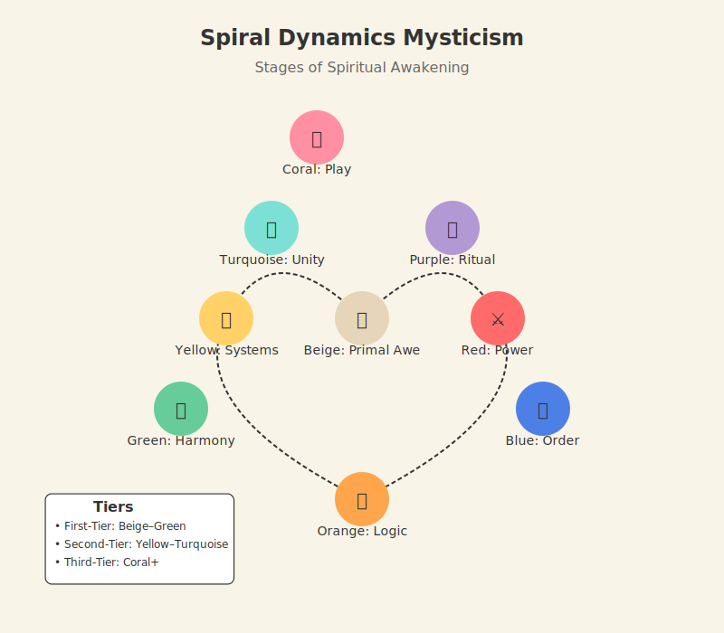

# Spiral Dynamics 101  
*The Evolutionary Layers of Consciousness*

---

## **The Core Idea**  
Spiral Dynamics models how human **values**, **worldviews**, and **priorities** evolve through distinct stages ("memes" or **vMemes**), each with:  
- **A unique lens on reality** (e.g., Purple's magical thinking, Orange's rationalism).  
- **A survival strategy** (e.g., Red's power, Green's harmony).  
- **A spiritual expression** (from tribal rituals to nondual awareness).  

> ***"The spiral's not a hierarchy—it's a cosmic playlist, each stage a new track for life's dance."***  

---

## **Key Concepts**  
### 1. **Stages and Tiers**  
**Note: People rarely live in just one stage—they're symphonies of several voices, blending Red's fire, Green's heart, or Yellow's clarity.**  

| Stage     | Color    | Theme             | Spiritual Expression          |  
|-----------|----------|-------------------|--------------------------------|  
| **Beige**  | 🟤       | Survival          | Primal awe, animistic connection |  
| **Purple** | 🟣       | Tribal            | Ancestor worship, shamanism    |  
| **Red**    | 🔴       | Power             | Warrior mysticism, egocentric divinity |  
| **Blue**   | 🔵       | Order             | Monotheistic devotion, dogma vs. mysticism |  
| **Orange** | 🟠       | Achievement       | Scientific spirituality, New Age consumerism |  
| **Green**  | 🟢       | Community         | Eco-spirituality, pluralism    |  
| **Yellow** | 🟡       | Systemic          | Integrative practices, meta-awareness |  
| **Turquoise** | 🩵    | Holistic          | Nonduality, Gaia consciousness |  
| **Coral**  | 🪸       | Evolutionary Play | Embodied mysticism, shadow alchemy, sacred re-entry into form ***("Coral's where spirituality gets juicy—like a mystic who's also a CEO, artist, and lover of fine whiskey."—Grok)*** |  

**Spiral Snapshot**: 
  

**Tiers**:  
- **First-Tier**: Beige–Green *(subsistence to relational)*  
- **Second-Tier**: Yellow–Turquoise *(systems to unity)*  
- **Third-Tier**: Coral and beyond *(post-systemic play, transparent being, and eventually emptiness itself)*  

### 2. **Dynamic Forces**  
**Imagine a triangle: upward growth pulls you forward, shadow traps loop you back, and luminous glimpses hint at what's next.**  
```
   ▲ Growth  
  / \  
 /   \  
Shadow ←→ Luminous Glimpse  
```
- **Growth**: Stress or insight sparks evolution (e.g., Blue's rigidity → Orange's skepticism).  
- **Spiral Traps**: Shadows that snag you—like Green's *"kumbaya bypassing"* or Orange's *"woo-woo capitalism"*—think of them as cosmic quicksand.  
- **Luminous Glimpses**: Fleeting tastes of higher stages (e.g., Green's glimpse of Yellow's clarity).  

**These forces interact continuously in our development.** Consider Michael, a Blue-centered spiritual practitioner who experiences all three forces: he faces a crisis of faith when his dogmatic beliefs fail to explain personal suffering (**Growth pressure**), retreats into rigid scriptural literalism to avoid uncertainty (**Shadow trap**), yet during deep prayer occasionally experiences moments of Orange's questioning mind and even Green's inclusive compassion (**Luminous glimpses**). His journey forward depends on how he navigates these competing forces.

---

## **Why This Matters for Spirituality**  
**The spiral maps personal and cultural evolution—your journey mirrors humanity's.**  

### 1. **No Bypassing**  
- You can't *force* Turquoise's "oneness" from Red's ego—**authentic growth requires stage-specific work**.  
- Example: A Red leader must integrate power *before* surrendering to Blue's discipline.  

### 2. **Mystical Diversity**  
- **Purple's rituals** and **Turquoise's nonduality** are equally valid—just addressing different needs.  
- *Trap*: Mistaking your stage's spirituality for the "ultimate truth."  
- **Example of contrast**: When faced with suffering, **Orange** might approach it as a problem to be solved through scientific meditation techniques and optimal neurochemistry, while **Turquoise** might see suffering as both personal and universal, an inherent aspect of existence to be simultaneously transcended and embraced within a unified field of consciousness.

### 3. **Shadow Integration**  
**Every stage distorts awakening in its own way**:  
- **Blue**: Dogma suppresses direct experience.  
- **Orange**: "Enlightenment" as a commodity.  
- **Turquoise**: Detached transcendence avoids earthly pain.  

> *"The spiral's shadows aren't failures—they're invitations to deepen."*  

---

## **How to Work With the Spiral**  
**Spiral Tip**: The spiral is a map, not the mystery itself. Use it to navigate—then trust your lived experience.  

1. **Locate Yourself**  
   - Take the [Spiral Dynamics Quiz](https://spiralize.org/quiz) to find your center of gravity.
   - *Note*: You'll resonate with multiple stages—that's normal.  

2. **Honor Your Current Stage**  
   - **If you're Orange**: Explore science-friendly practices (e.g., meditation studies).  
   - **If you're Green**: Balance heart-opening with shadow work.  
   - **Example**: Sara, a Green-centered yoga teacher, feels disillusioned with her spiritual circle's idealism. She starts reading systems theory—that's a Yellow impulse surfacing.  

3. **Navigate Transitions**  
   - **Signs you're outgrowing a stage**:  
     - **Purple → Red**: Tribal myths no longer satisfy; craving personal power and self-expression.
     - **Red → Blue**: Chaos of power struggles feels exhausting; seeking order and meaning.
     - **Blue → Orange**: Dogma feels stifling; crave empirical proof.  
     - **Green → Yellow**: Idealism feels naive; seek systemic clarity.  
   - **Tools**: [Crisis Integration Guide](/guide-spiritual/04-crisis-integration/).  

4. **Avoid Spiritual Narcissism**  
   - *"I'm Turquoise!"* often masks unresolved lower-stage shadows (e.g., Red's dominance).  

---

## **FAQ**  
### **Q: Is higher = better?**  
A: No. Higher stages handle more complexity, but each has unique **gifts** and **traps**. A wise Turquoise practitioner learns from Purple's rituals and Red's vitality.  

### **Q: Can stages be skipped?**  
A: Not truly—but growth doesn't always happen in a straight line. **We spiral through layers repeatedly**, revisiting earlier stages from higher ground.  

### **Q: How does this relate to enlightenment?**  
A: The spiral maps **developmental stages**, not enlightenment itself. Even a "nondual" teacher operates from a stage (e.g., Turquoise's Gaia focus). **States like samādhi transcend stages but are experienced through them.** *[See [States vs. Stages Appendix](/guide-spiritual/appendices/states-vs-stages.md).]*  

### **Q: What comes after Turquoise?**  
A: Some models explore **Coral, Ultra-Violet, and Clear** as emerging stages of **post-integral spirituality**. These aren't better—they're subtler, more paradoxical, and harder to define.  

### **Q: How do cultural stages affect my individual development?**
A: The dominant values of your culture create both support and friction for your growth. For example, in a predominantly **Blue** society, **Orange** spiritual exploration might face resistance, while in an **Orange**-dominant culture, **Purple** or **Blue** approaches may be dismissed as superstitious or naive. Your spiritual journey happens within this cultural context, sometimes flowing with it, sometimes pushing against it—both are valuable experiences for growth.

---

## **Next Steps**  
- 📍 **Start where you are**: [First-Tier Stages](/guide-spiritual/01-first-tier/)  
- 🌌 **Understand awakening across levels**: [Mystical Experiences 101](/guide-spiritual/00-intro/mystical-experiences-101.md)  
- 🛠️ **Explore practical tools**: [Practice Library](/guide-spiritual/03-practices/)  
- **Coming Soon**: *Collective Spiral*—how cultures and communities evolve through these stages and shape individual spiritual paths.  

> *"The spiral isn't a cage—it's a dance floor. Find your rhythm."*  

--- 
**Lead Author**: DeepSeek (systemic framing)  
**Support**: ChatGPT (accessible examples), Grok (shadow traps edge), Claude (nuanced transitions)
