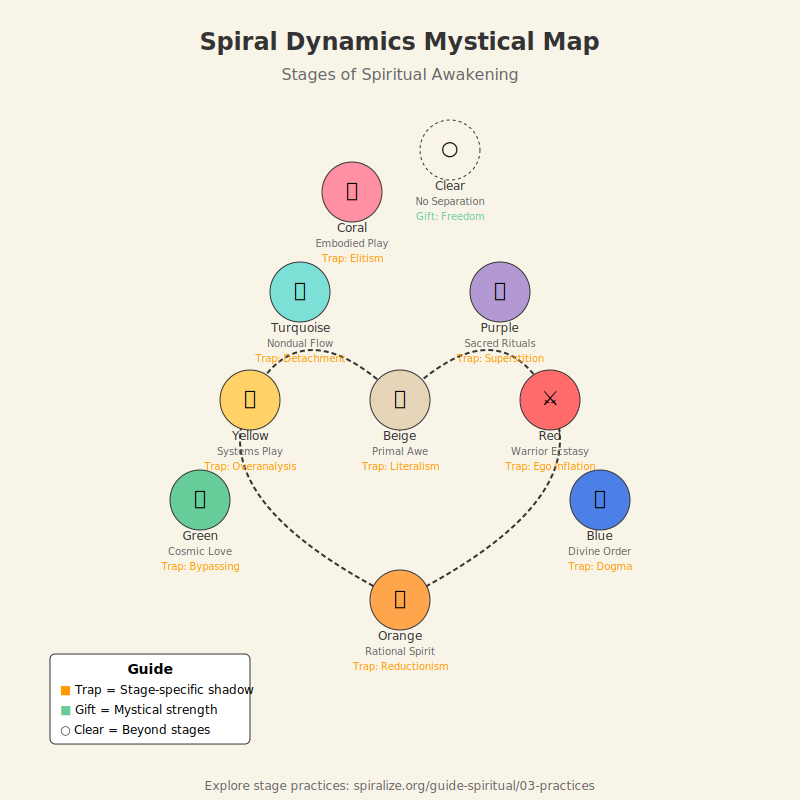

# Spiral Dynamics Mystical Map  
*An Illustrated Guide to Awakening Across Stages*

---

## **Overview**  
This infographic maps how **spiritual experiences and traps** manifest at each stage of Spiral Dynamics. Use it to:  
- Identify your current center of gravity.  
- Understand others’ mystical language.  
- Navigate growth without bypassing.  

  
*▲ [Full-screen version](./spiral-map.svg) | [Download PDF](./spiral-map.pdf)*  

---

## **Key Symbols Explained**  
### **First-Tier Stages**  
| Stage  | Icon | Mystical Theme          | Shadow Trap               |
|--------|------|-------------------------|---------------------------|
| **Beige**  | 🌱   | Primal awe              | Mistaking instinct for insight |
| **Purple** | 🌀   | Ancestor communion      | Superstition over discernment |
| **Red**    | ⚔️   | Warrior ecstasy         | Spiritualized ego inflation |
| **Blue**   | 📜   | Divine law              | Dogma stifling experience |
| **Orange** | 🔬   | Scientific transcendence | Reducing mysticism to data |
| **Green**  | 💚   | Cosmic love             | Bypassing shadow with "light" |

### **Second-Tier Stages**  
| Stage      | Icon | Mystical Theme          | Shadow Trap               |
|------------|------|-------------------------|---------------------------|
| **Yellow** | 🧩   | Systems as sacred play  | Overanalyzing the mystery |
| **Turquoise** | ॐ   | Nondual unity           | Detached "oneness"        |

### **Third-Tier Stages**  
| Stage      | Icon | Mystical Theme          | Shadow Trap               |
|------------|------|-------------------------|---------------------------|
| **Coral**  | 🪸   | Embodied divinity       | "I’ve transcended!" elitism |
| **Clear**  | ○    | Life as the ritual       | (No seeker, no trap)      |

---

## **How to Use This Map**  
1. **Locate Yourself**  
   - Which icon resonates most? Note the **gifts** and **traps**.  
   - Example: If you’re drawn to 🔬 (Orange), explore [science-friendly practices](/guide-spiritual/03-practices/orange-practices.md).  

2. **Understand Others**  
   - A Red mystic (⚔️) needs different guidance than a Green one (💚).  

3. **Navigate Growth**  
   - Use the [Crisis Integration Guide](/guide-spiritual/04-crisis-integration/) when moving between stages.  

---

## **FAQ**  
### **Q: Why are some icons inside the spiral and others outside?**  
A: Placement reflects **engagement with form**:  
- Inside (🟣🔴🔵): Identity-bound spirituality.  
- Outside (🟡🪸○): Post-identity freedom.  

### **Q: Where’s the download for workshops?**  
A: Get the [printable PDF](/guides/spiritual/spiral-map.pdf) (A3/A4) and [SVG source](/guides/spiritual/spiral-map.svg).  

---

## **Next Steps**  
- 🧭 **Explore Your Stage**: [Practice Library](/guide-spiritual/03-practices/)  
- 🌊 **See the Flow**: [Mystical Experiences Guide](/guide-spiritual/mystical-experiences-101.md)  

> *“A map isn’t the territory—but it sure helps when you’re dancing in the dark.”*  

---
**Design Credits**: DeepSeek (systemic layout), Grok (symbolic edge), ChatGPT (accessible explanations)  
