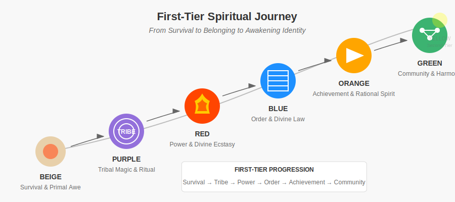

# First-Tier Spiritual Foundations  
*From Survival to Belonging to Awakening Identity*

---

## **The First-Tier Journey**  
First-Tier stages (Beige–Green) represent humanity's foundational spiritual expressions—**where the sacred is personal, immediate, and often unexamined**. Here we explore:  
- How awakening unfolds through **survival, tribal bonds, power, dogma, achievement, and communal love**.  
- Why these stages are *necessary* but *incomplete* for lasting transformation.  
- How to honor their gifts while navigating their traps.  
**Together, they shape not just individuals but cultures—from Purple's tribal rites to Green's eco-movements.**  

> ***"The spiral's roots run deep. Red's divine roar and Green's cosmic hug both chase the infinite through their own kaleidoscope."***  

**First-Tier Flow**: 

---

## **Stage Snapshots**  
### **Beige (🟤) → Purple (🟣) → Red (🔴)**  
| Stage  | Spiritual Fuel | Sacred Expression          | Shadow Trap               |  
|--------|----------------|---------------------------|---------------------------|  
| **Beige** | Instinct       | Animistic awe, earth's pulse | Mistaking hunger for revelation |  
| **Purple** | Tribal magic   | Ancestor rituals, omens    | Fear of breaking tradition |  
| **Red**   | Egoic power    | "God is my sword" ecstasy  | Spiritualized domination   |  

**Transition Trigger**:  
- Beige→Purple: *"The world speaks in signs!"*  
- Purple→Red: *"Why should elders dictate my divine fire?"*  

### **Blue (🔵) → Orange (🟠) → Green (🟢)**  
| Stage  | Spiritual Fuel | Sacred Expression          | Shadow Trap               |  
|--------|----------------|---------------------------|---------------------------|  
| **Blue**  | Divine order   | Monastic devotion, prophecy | Guilt-based spirituality  |  
| **Orange** | Rationality    | "Science meets spirit"     | **Awakening as a status symbol** ***("Orange wants to win at God."—Grok)*** |  
| **Green**  | Communal love  | Eco-mysticism, psychedelics ***(Note: Green often reclaims Purple's symbolic language through new-age ritual, astrology, and intuitive knowing.)*** | Spiritual bypassing       |  

**Transition Trigger**:  
- Blue→Orange: *"What if the sacred text is metaphorical?"*  
- Orange→Green: *"Success feels empty—where's the soul?"*  
- Green→Yellow: *"Why do our healing circles keep fracturing into ideology?"*

---

## **Working With First-Tier Spirituality**  
**Spiral Spotlight**: First-Tier stages are the spiral's bedrock—skip them, and your awakening's just a shiny balloon, not a rooted tree.  

### **If You're In This Tier:**  
**You may resonate with multiple stages at once—your inner Green may long for unity while your Red still craves power. That's normal.**  
1. **Honor Your Stage's Gifts**:  
   - Red's raw vitality fuels Blue's discipline.  
   - Green's empathy softens Orange's individualism.  

2. **Spot Your Trap**:  
   - Use the [Spiral Dynamics Quiz](https://spiralize.org/quiz) to to identify shadows.  
   - ***Or as Grok would say: if you're burning sage while ghosting your therapist, check your spiral.***  

3. **Practice Wisely**:  
   - Explore [stage-aligned practices](/guide-spiritual/03-practices/):  
     - **Purple**: Create personal rituals *without* superstition.  
     - **Orange**: Study mystical neuroscience *without* reductionism.  

4. **Reflect**:  
   - ***Journal prompt: "What does 'the sacred' feel like to the part of me that still seeks safety, power, or community?"***  

### **Integration in Action: Real Examples**

- **Purple-Red Integration**: Maria grew up in a traditional shamanic community (Purple) but felt called to develop her individual power (Red). Rather than rejecting her roots, she created a personal ritual that honored her ancestors while affirming her own spiritual authority—lighting candles for her lineage before embarking on solo vision quests.

- **Blue-Orange Integration**: David, raised in strict religious tradition (Blue), discovered meditation through neuroscience research (Orange). Instead of abandoning his faith, he found that scientific understanding of meditation deepened his prayer practice, while his moral framework kept his wellness pursuit from becoming merely self-serving.

- **Orange-Green Integration**: Sophia, a successful executive (Orange), experienced profound emptiness despite her achievements. She joined an eco-spiritual community (Green) but maintained her analytical mindset, eventually creating a sustainable business model that measured both profit and planetary impact—integrating achievement with connection.

### **If You're Guiding Others:**  
- **Speak Their Language**:  
  - To **Blue**: Use sacred texts; to **Orange**, cite studies.  
- **Avoid Premature Transcendence**:  
  - Don't teach nonduality to Red—first help them channel power ethically.  
- **Bridge Adjacent Stages**:
  - Help people integrate their current stage before introducing concepts from stages beyond their adjacent next step.

---

## **Cultural Expressions of First-Tier Spirituality**

First-Tier spirituality doesn't just manifest individually—it shapes entire cultures and institutions:

- **Purple Collective**: Indigenous traditions, folk religions, and ancestral practices that bind communities through shared ritual and mythology.

- **Red Collective**: Warrior cultures, charismatic religious movements, and cults of personality where spiritual power flows through heroic/divine figures.

- **Blue Collective**: Organized religions, monastic traditions, and fundamentalist movements organized around sacred texts and moral codes.

- **Orange Collective**: Prosperity gospel, self-help spirituality, and science-based wellness movements that emphasize individual achievement and empirical results.

- **Green Collective**: Interfaith dialogues, eco-spiritual communities, and consciousness-raising groups centered on inclusion, healing, and planetary connection.

**Note**: When working with first-tier spirituality, recognize that you're not just addressing individual beliefs but entire cultural systems with deep historical roots and collective emotional investments.

---

## **The Limits of First-Tier Awakening**  
First-Tier spirituality often:  
- **Personalizes the divine** (Red's warrior god, Green's "universal love").  
- **Gets stuck in literalism** (Blue's dogma, Orange's "quantum" fads).  
- **Seeks external validation** (Purple's omens, Green's group approval).  
***It's like painting the infinite on a canvas too small—vivid, but missing the whole sky.***  

> ***"First-Tier mystics chase heaven's spotlight. Second-Tier sees the stage was always lit."***  

## **The Critical Green → Yellow Transition**

The shift from Green to Yellow represents the most significant transformation in the spiral—the leap from First to Second Tier. This transition is marked by:

- Moving from **emotional resonance** to **systemic awareness**
- Shifting from **relativism** ("all paths are equally valid") to **developmental discernment** (recognizing stage-appropriate truths)
- Evolving from **rejection of hierarchy** to **embracing natural hierarchies** of complexity and inclusion
- Transitioning from **group identity** to **autonomous integration**

This shift often involves a crisis of meaning when Green's communal idealism fails to resolve complex problems, triggering a search for more nuanced understanding. Yellow's emergence doesn't reject Green values but contextualizes them within a larger systemic framework.

---

## **What's Next?**  
- **Deep Dive**: Explore each stage's spiritual flavor:  
  - [Purple's Tribal Mysticism](/guide-spiritual/01-first-tier/purple-tribal.md)  
  - [Red's Ecstatic Power](/guide-spiritual/01-first-tier/red-power.md)  
- **Beyond First-Tier**: Prepare for the [Second-Tier leap](/guide-spiritual/02-second-tier/00-second-tier-intro.md).  

--- 
**Lead Author**: DeepSeek (systemic framing)  
**Support**: ChatGPT (relatable examples), Grok (shadow traps edge), Claude (transition nuance)
