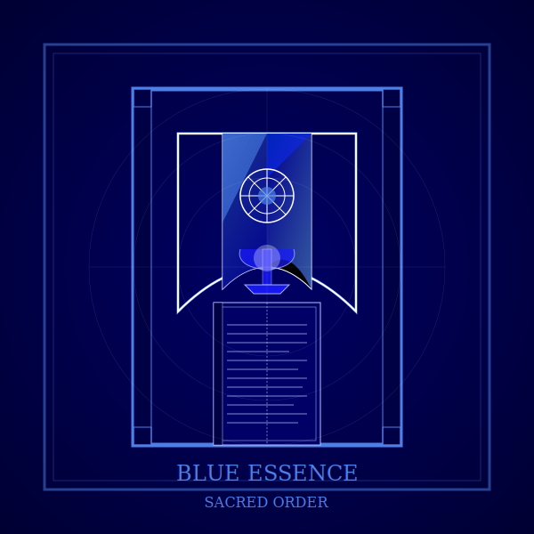

# Blue: Sacred Order  
*Where the Divine Wears a Rulebook*

---

## **The Blue Mystical Experience**  
Blue spirituality is **cosmic law etched in stone**—a divine contract between order and devotion:  
- **Sacred Expressions**:  
  - Monastic discipline (*"Obedience is prayer."*)  
  - Mystical heresies (*Sufi whirling, Christian contemplatives*)  
  - Scriptural literalism (*"The truth is in the text, word for word."*)  
- **Shadow**: Confusing tradition for truth (*"If it's ancient, it's sacred."*).  

> ***"Blue doesn't chase the divine—it carves its path in granite, then walks it with unshakable faith."***  

**Blue Essence**: 
  

---

## **Historical and Evolutionary Context**

Blue consciousness emerged as civilizations needed unified moral codes and structured belief systems to organize expanding societies:

- **Temporal Frame**: Became dominant around 5,000 BCE with the rise of agricultural civilizations and organized religions
- **Societal Structure**: Hierarchical institutions, kingdoms, empires, and organized religions
- **Survival Strategy**: Order through shared belief in divine authority and sacred law
- **Cultural Markers**:
  - Major world religions (Judaism, Christianity, Islam, Hinduism, Buddhism)
  - Legal codes derived from religious principles (Hammurabi's Code, Sharia, Canon Law)
  - Systems of ritual, prayer, and practice that structure daily life

Blue's historical significance was transformative—it moved humanity beyond the chaos of Red's power struggles into societies capable of enduring stability through shared submission to higher authority. It made possible the great civilizations by channeling human energy toward transcendent purpose rather than immediate gratification.

---

## **Why This Matters**  
**Sacred Blueprint**: Blue's gift is structure—its rules and rituals anchor societies, from ancient temples to modern courts, giving chaos a frame.  

### **1. The Gift of Sacred Container**  
Blue offers what Red's chaos lacks:  
- **Moral clarity**: Absolute ethics in a relativistic world.  
- **Communal liturgy**: The solace of shared ritual.  
- **Hidden mystics**: Those who bend dogma from within (*e.g., Julian of Norwich*).  

### **2. The Trap: When Law Crushes Spirit**  
- **Modern Pitfalls**:  
  - Fundamentalist anxiety (*"If I doubt one verse, the whole edifice crumbles."*)  
  - Spiritual gaslighting (*"Your vision contradicts the elders—it must be demonic."*)  
  - Mistaking the map for the territory (*"The ritual itself is sacred, not what it points to."*)

---

## **Blue Across Traditions**

Blue spirituality takes distinct forms across religious contexts while maintaining its essential pattern of sacred order:

- **Abrahamic Expressions**: Torah study in Judaism, canonical prayer in Islam, liturgical worship in Christianity—all emphasizing scripture, law, and proper observance
  
- **Eastern Expressions**: Vedic ritual in Hinduism, monastic precepts in Buddhism, ceremonial propriety in Confucianism—structured paths to transcendence
  
- **Secular Expressions**: Constitutional reverence, academic orthodoxy, professional codes of ethics—non-religious contexts where principles are treated with sacred respect

The core Blue impulse—finding the divine through structured devotion and principled living—transcends specific theology. Blue finds God through righteousness, whether that means following the Eightfold Path or the Ten Commandments.

---

## **Working With Blue Energy**  
**Blue's order lives in modern institutions—think legal codes, religious services, or even corporate handbooks, all craving stability through shared truth.**  

### **If You're Blue-Centered**  
- **Practice**:  
  - **Contemplative Reading**: Lectio Divina with room for personal revelation.  
  - **Ethical Inquiry**: *"Would God punish questioning, or reward integrity?"*  
  - ***Interfaith Exploration: Explore another tradition's sacred texts not to disprove them—but to hear how other staircases to heaven were built.***  
- **Caution**: Distinguish devotion from fear (*"Am I loving God, or fearing hell?"*).  
- ***Reflect: "What's one belief I've inherited that still feels sacred… and one I'm afraid to question?"***  

### **If You've Transcended Blue**  
- **Reclaim Its Gifts**:  
  - Orange's skepticism feels hollow without Blue's depth of commitment.  
  - Try: **Ritualized routine** (e.g., morning tea as secular Eucharist).  

### **Healthy vs. Unhealthy Blue**

There's a profound difference between mature Blue spirituality and its fundamentalist shadows:

**Healthy Blue:**
- Finds security in tradition while maintaining humble openness to mystery
- Respects authority while taking personal responsibility for ethical choices
- Values scripture as revelation while acknowledging human interpretation
- Practices discipline as devotion rather than fearful obligation
- Creates order that serves human flourishing rather than controlling it

**Unhealthy Blue:**
- Demands rigid conformity to protect against existential anxiety
- Externalizes moral authority completely, avoiding personal discernment
- Collapses symbol into literal fact, missing the deeper meanings
- Uses guilt and shame as primary motivators for righteous behavior
- Sacrifices compassion on the altar of doctrinal purity

The journey from unhealthy to healthy Blue often involves discovering that questioning can deepen faith rather than destroy it—that God is bigger than our rules about God.

---

## **The Blue-to-Orange Transition**

The shift from Blue to Orange represents one of history's great liberation moments, both collectively and individually:

- **Catalysts for Transition**:
  - Encountering contradictions within traditional teachings
  - Exposure to different belief systems with equal conviction
  - Desire for empirical verification of religious claims
  - Frustration with restrictions that seem arbitrary rather than principled

- **Transition Struggles**:
  - Guilt about questioning sacred authority
  - Fear of divine punishment for intellectual exploration
  - Grief over lost certainty and community belonging
  - Anxiety about personal responsibility for truth-seeking

- **Integration Challenge**: Maintaining Blue's moral compass and devotional depth while embracing Orange's critical thinking—finding a faith that welcomes questions rather than fears them.

This transition often begins as an intellectual crisis that becomes spiritual: "If this teaching isn't literally true, what else might be metaphorical? And if some is metaphorical, how do I know what's real?"

---

## **Blue in Modern Life**  
### **Archetypes**  
- **The Bureaucrat Mystic**: Tax codes as sacred texts, spreadsheets as rosaries.  
- **Heretic Scholars**: ***Think of mystics like Thomas Merton or Karen Armstrong—devout seekers who honored the text, but let spirit lead the interpretation.***  
- **Ethical Pillars**: Those whose moral clarity serves their community without imposing it—the judge who upholds principles with compassion.
- **Ritual Keepers**: Those who maintain traditions that connect generations—the grandmother who passes down holiday customs with their deeper meanings.

### **Shadow Manifestations**  
- **Corporate Dogma**: Mission statements as unquestionable creed. ***It's like worshipping a PowerPoint slide—rigid, but soulless.***  
- **Wellness Fundamentalism**: *"This diet is the *only* path to enlightenment."* ***Grok: Blue gave us commandments. Now it gives us kombucha commandments.***  
- **Spiritual Legalism**: Measuring devotion by external compliance rather than inner transformation. ***"They've memorized the scripture but missed the sermon."***

---

## **Integration Milestone**  
**You've integrated Blue when**:  
- You cherish tradition *without* needing it to be perfect.  
- Your spiritual practice has structure, but the walls breathe.  
- You can distinguish between eternal principles and their temporal expressions.
- You hear both the letter and spirit of sacred teachings.
- You feel reverence without rigidity, devotion without defensiveness.

> ***"A true disciple masters the rules—and breaks them only for love's sake."***  

---

## **Next Steps**  
- **Explore**: [Orange's Rational Spirit](/guide-spiritual/sections/01-first-tier/orange-rational.md) (the next stage).  
- **Practice**: [Blue-Aligned Tools](/guide-spiritual/sections/03-practices/blue-practices.md) (sacred study, ethical discernment).  

--- 
**Lead Author**: Claude (contemplative wisdom)  
**Support**: DeepSeek (historical framing), Grok (edgy metaphors), ChatGPT (accessible practices)

"Every law was once a revelation—and every revelation becomes law, until the next rebel." 📜🔥