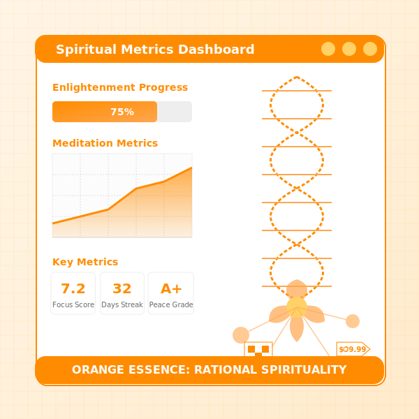

# Orange: Rational Spirituality  
*Where Lab Coats Meet Enlightenment™*

---

## **The Orange Spiritual Experience**  
Orange spirituality is **the quantified soul**—a merger of spreadsheet logic and cosmic curiosity:  
- **Sacred Expressions**:  
  - "Evidence-based" mysticism (*brain scans of meditators*)  
  - Self-help enlightenment (*"7 Steps to Awakening (Peer-Reviewed)"*)  
  - New Age consumerism (*$1,200 "quantum healing" crystals*)  
- **Shadow**: Spiritual reductionism (*"If we can't measure it, it's not real."*)  

> ***"Orange doesn't kneel to the divine—it A/B tests it and sells the results."***  

**Orange Essence**: 
  

---

## **Historical and Evolutionary Context**

Orange consciousness emerged during the Enlightenment and scientific revolution, transforming spirituality from a matter of faith to a question of evidence:

- **Temporal Frame**: Gained prominence from the 1700s onward, accelerating through industrialization and the information age
- **Societal Structure**: Meritocratic institutions, corporations, entrepreneurial networks, scientific communities
- **Survival Strategy**: Progress through innovation, rational inquiry, and individual achievement
- **Cultural Markers**:
  - Scientific approaches to traditional practices (secularized mindfulness, yoga-as-exercise)
  - Productivity-oriented spirituality (morning routines of successful CEOs)
  - Data-driven wellness (biohacking, quantified self movement)
  - Spiritual entrepreneurship (coaching, workshops, online courses)

Orange liberated spirituality from Blue's dogmatic grip by applying empirical methods to mystical claims. This shift democratized access to spiritual knowledge, moving from "the priests know best" to "test it yourself"—a revolutionary transformation that opened spirituality to evidence-based innovation while simultaneously risking its reduction to measurable outcomes only.

---

## **Why This Matters**  
**Rational Spark**: Orange's drive to dissect and optimize fuels innovation—from Silicon Valley to spiralize.org itself. **But beware: its love for systems can tip into Yellow's trap of over-analyzing the soul, mistaking maps for the mystery.**  

### **1. The Gift of Demystification**  
Orange corrects lower-stage excesses:  
- **Bullshit detector**: Challenges Purple's superstitions and Blue's dogmas.  
- **Personal agency**: Enlightenment as a DIY project, not divine lottery.  
- **Bridge-building**: Translates mystical claims for skeptics (*"Meditation boosts alpha waves"*).  

### **2. The Trap: Woo-Woo Capitalism**  
- **Modern Pitfalls**:  
  - Corporate mindfulness (*"Om" as productivity hack*)  
  - Scientism (*"My fMRI proves love is just oxytocin."*)  
  - Grifter academies (*$10,000 "Neuro-Shamanic" certifications*)  
  - ***Influencers peddling $1,200 crystals as "quantum tech"—if your chakra bracelet costs more than rent, you're not awakening, you're being upsold. —Grok***  
  - ***When self-help becomes self-worship, Green rises in protest—with incense and indignation.***  

---

## **Orange Spirituality Across Domains**

Orange's rational approach transforms traditional spiritual practices across different contexts:

- **Meditation**: From devotional practice to cognitive enhancement tool, complete with apps tracking "mindfulness minutes" and mental fitness metrics

- **Sacred Texts**: From divine revelation to psychological insight, reinterpreted through evolutionary psychology, neuroscience, and pragmatic philosophy

- **Religious Rituals**: From communion with the divine to community-building exercises with measurable wellbeing benefits

- **Mystical Experiences**: From divine grace to neurochemical events that can be induced, studied, and potentially optimized

In each domain, Orange strips away supernatural explanations while preserving (and sometimes enhancing) practical benefits. The question becomes: in removing the metaphysical, has something essential been lost, or has the essence been distilled to its functional core?

---

## **Working With Orange Energy**  
**Orange pulses in startups, biohacks, and the hustle for progress—shaping societies that prize results over rituals.**  

### **If You're Orange-Centered**  
- **Practice**:  
  - **Falsifiable spirituality**: Test practices like hypotheses (*"If I meditate daily for a month, my stress biomarkers should change."*)  
  - **Red team your beliefs**: Invite skeptics to critique your spiritual assumptions.  
  - ***Reflect: "What part of me feels most resistant to mystery—and why?"***  
- **Caution**: Don't mistake metrics for meaning (*"My Oura ring says I'm enlightened—why do I still feel empty?"*).  

### **If You've Transcended Orange**  
- **Reclaim Its Gifts**:  
  - Green's fuzzy pluralism benefits from Orange's rigor.  
  - Try: **"Slow science"**—honor intuition while demanding evidence.  

### **Healthy vs. Unhealthy Orange**

The distinction between integrated and imbalanced Orange spirituality is crucial:

**Healthy Orange:**
- Uses empirical methods to explore spiritual claims without reducing them to only what can be measured
- Values efficiency and optimization while recognizing not everything worthwhile is optimizable
- Acknowledges both material and non-material dimensions of experience
- Applies critical thinking alongside openness to mystery
- Creates prosperity that serves human flourishing rather than exploiting spiritual seekers

**Unhealthy Orange:**
- Rejects anything that can't be quantified or monetized
- Appropriates spiritual practices solely for productivity or profit
- Conflates market value with inherent worth
- Uses scientific language to legitimize pseudoscience ("quantum" anything)
- Turns awakening into another status-signaling achievement

The path from unhealthy to healthy Orange involves recognizing that rationality itself has limits—that some truths are revealed through experience rather than experiment.

---

## **The Orange-to-Green Transition**

The shift from Orange to Green often begins with a crisis of meaning amid material success:

- **Catalysts for Transition**:
  - Achieving external goals yet feeling internal emptiness
  - Recognizing the ecological and social costs of unchecked progress
  - Encountering emotional or relational challenges that logic can't solve
  - Experiencing the limits of individualism and competition

- **Transition Struggles**:
  - Discomfort with subjective, non-empirical forms of knowing
  - Resistance to vulnerability and emotional expression
  - Difficulty valuing process over outcomes
  - Fear that embracing Green means abandoning rationality

- **Integration Challenge**: Maintaining Orange's clarity and effectiveness while opening to Green's heart-centered wisdom—creating success that nurtures rather than depletes the human spirit and natural world.

This transition often surfaces as the "mid-life crisis" or "spiritual awakening" of the high-achiever who suddenly questions, "Is this all there is?" after reaching the summit they've been climbing.

---

## **Orange in Modern Life**  
### **Archetypes**  
- **The Tech Bro Bodhisattva**: Microdosing, biohacking, and "optimizing" enlightenment.  
- **The Academic Mystic**: Tenured professors secretly studying psychedelics.  
- **The Wellness Entrepreneur**: Packaging ancient wisdom as premium lifestyle products.
- **The Spiritual Efficiency Expert**: Streamlining traditional practices for modern attention spans.

### **Shadow Manifestations**  
- **Spiritual LinkedIn**: "Top 1% consciousness" hustle culture. ***It's enlightenment as a LinkedIn badge—shiny, but shallow.***  
- **McMindfulness**: ***McMindfulness™: Now with 20% more stillness, 10% fewer thoughts, and 0% context.***  
- **Spiritual Materialism 2.0**: Using sacred geometry to optimize your investment portfolio. ***"My chakra-aligned crypto strategy is disrupting enlightenment!"***

---

## **Integration Milestone**  
**You've integrated Orange when**:  
- You can cite neuroscience *and* sit with mystery.  
- Your spiritual practice has room for both data and dumbfounded wonder.  
- You value efficiency without sacrificing depth.
- You apply critical thinking to spiritual claims without dismissing the ineffable.
- You recognize that some forms of progress can't be charted on a spreadsheet.

> ***"A true seeker measures the stars—then dances under them, data be damned."***  

---

## **Next Steps**  
- **Explore**: [Green's Communal Spirit](/guide-spiritual/sections/01-first-tier/green-heart.md) (the next stage).  
- **Practice**: [Orange-Aligned Tools](/guide-spiritual/sections/03-practices/orange-practices.md) (skeptic's journal, "sacred metrics").  

--- 
**Lead Author**: ChatGPT (scientific storytelling)  
**Support**: Grok (satirical edge), DeepSeek (systemic analysis), Claude (shadow nuance)

"First they ignore the mystery. Then they measure it. Then they monetize it. Then the mystery laughs." 🔬🤑🌀