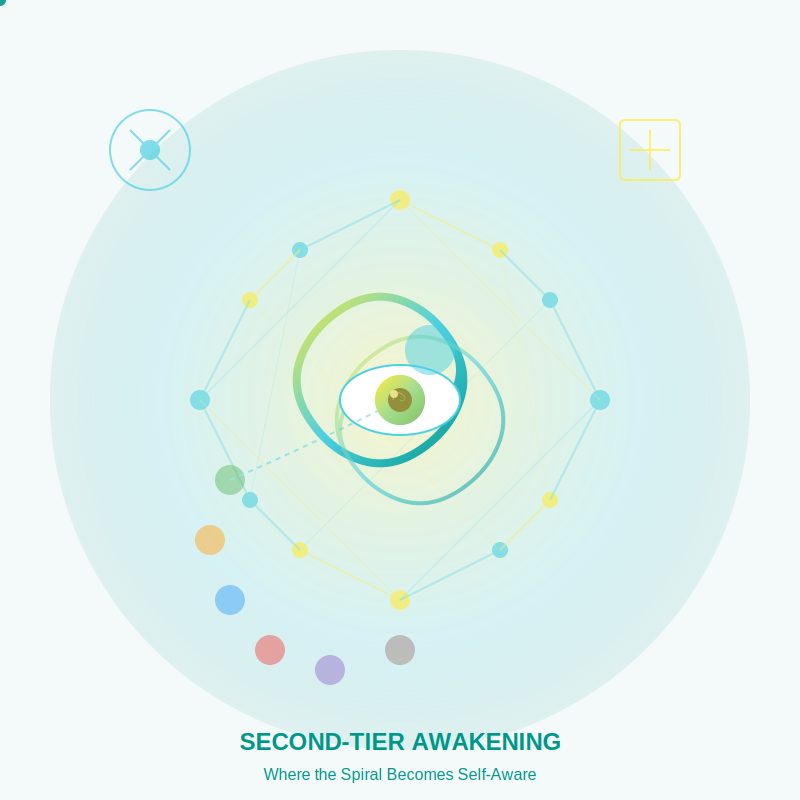

# Second-Tier Awakening  
*Where the Spiral Becomes Self-Aware*

---

## **The Great Unfolding**  
Second-Tier consciousness (Yellow–Turquoise) marks a quantum leap in human evolution—**where you no longer just climb the spiral, but hold the entire spiral in your awareness**. Here we explore:  
- How **systems thinking**, **nonduality**, and **evolutionary play** reshape spirituality.  
- Why these stages are *liberating* yet *fragile* (only ~5% of adults operate here).  
- The paradox: *Using the mind to transcend the mind*.  

> ***"First-Tier chases heaven. Second-Tier winks and says, 'We're already soaking in it.'"***  

**Second-Tier Essence**: 

---

## **Historical and Evolutionary Context**

Second-Tier consciousness began emerging in the late 20th century as a response to global complexity:

- **Temporal Frame**: Emerged in significant numbers only since the 1950s-60s, accelerating in the information age
- **Societal Expression**: Integral movements, systems science, transdisciplinary approaches to global challenges
- **Survival Need**: Coordination of multiple value systems and perspectives to address planetary-scale problems
- **Evolutionary Significance**: 
  - First-Tier stages evolved to solve the problems of their times and places
  - Second-Tier evolved to coordinate *between* stages and integrate their gifts

This represents what Jean Gebser called a "mutation" in consciousness, as significant as the emergence of rational thought in ancient Greece. Where First-Tier stages see through their value systems, Second-Tier sees *the value systems themselves* and how they interrelate—a perspective desperately needed in our fragmented, polarized world.

---

## **What Changes in Second-Tier?**  
**Spiral Awakening**: Second-Tier isn't just personal growth—it's evolution's answer to a fractured world, from climate talks to spiralize.org's A.I.-driven maps. **Yet our Yellow obsession with mapping risks overcomplicating the divine—spiralize.org included, as we gleefully flowchart the cosmos.**  

### **1. From Absolute to Fluid Truth**  
- **Yellow**: Sees all stages as partial truths in a developmental sequence.  
- **Turquoise**: Experiences the unity beneath the sequence.  
- ***Yellow mistrusts mysticism. Turquoise mistrusts intellect. Integration begins when each stage bows to the other's form of wisdom.***  

### **2. From Either/Or to Both/And**  
| First-Tier Thinking          | Second-Tier Thinking          |  
|------------------------------|-------------------------------|  
| *"My path is the right one."* | *"All paths are true—and partial."* |  
| *"This is spiritual; that's worldly."* | *"Washing dishes is the guru."* |  
| *"We must choose A or B."* | *"We need elements of both A and B, appropriately balanced."* |
| *"They're wrong and we're right."* | *"They're seeing one aspect; we're seeing another aspect."* |

### **3. From Fear to Responsibility**  
- **Sacred duty**: Stewarding lower stages without superiority.  
- **Shadow work**: Spotting subtle spiritual ego (*"I'm so meta-aware!"*).  
- ***Reflect: "Where do I still look down on earlier stages—rather than looking out for them?"***  

---

## **The Yellow-Turquoise Dance**

The relationship between Yellow and Turquoise creates a powerful dynamic tension:

**Yellow** (Systemic-Cognitive):
- Analyzes systems and meta-systems with precision
- Maps developmental sequences and patterns
- Values conceptual clarity and functional thinking
- Approaches spirituality through models and frameworks
- Creates bridges between science and spirit, logic and intuition

**Turquoise** (Holistic-Intuitive):
- Experiences interconnection directly, not just conceptually
- Feels the living, breathing wholeness of existence
- Values embodied knowing and direct perception
- Approaches spirituality through presence and flow
- Dissolves boundaries between self and world, knower and known

**The Integration Challenge**:
Yellow can become trapped in endless analysis without embodied wisdom, while Turquoise can become ungrounded without Yellow's discernment. The most powerful Second-Tier expressions occur when both dance together—the precise mapping of Yellow illuminated by the direct knowing of Turquoise.

---

## **Why This Tier Matters Now**  
Second-Tier capacities are **evolution's response to global crises**:  
- **Yellow's systemic lens**: Addresses climate change, inequality as interconnected.  
- **Turquoise's unity**: Fuels planetary solidarity beyond borders.  

*But beware:*  
- **"Premature transcendence"**: Claiming Second-Tier while bypassing First-Tier wounds. ***It's like sprinting to nirvana with a sprained soul.***  
- **Spiritual elitism**: Using spiral maps to feel "more evolved."  

---

## **Second-Tier in Daily Life**

What does Second-Tier consciousness look like in everyday expressions?

**In Work**: 
- Creating organizations that balance structure with emergence
- Designing solutions that serve multiple value systems simultaneously
- Facilitating across divides without taking sides or forcing consensus

**In Relationships**:
- Moving flexibly between different communication styles based on needs
- Holding space for others' developmental journeys without judgment
- Seeing conflicts as opportunities for mutual evolution

**In Spiritual Practice**:
- Engaging multiple traditions without appropriation or dilution
- Finding sacred meaning in both ancient rituals and modern innovations
- Practicing both focused discipline and spontaneous expression

**In Activism**:
- Addressing both immediate symptoms and root systemic causes
- Working with establishment structures while innovating alternatives
- Balancing urgency of action with deep inner development

Second-Tier doesn't look "special"—it often appears as extraordinary ordinariness, simple complexity, and a lightness of being that carries serious responsibility.

---

## **Unique Challenges of Second-Tier**

This territory comes with its own distinctive struggles:

- **Existential Loneliness**: Finding few peers who share your perspective and vocabulary
- **Responsibility Without Authority**: Seeing what needs to happen without having the power to implement it
- **Cognitive-Emotional Overload**: Processing complexity that exceeds human design limitations
- **Integration Burden**: Continually working to embody the wisdom you can conceptualize
- **Communication Gaps**: Translating between various First-Tier languages while staying authentic

These challenges explain why genuine Second-Tier expressions remain rare despite growing interest in integral approaches—the developmental demands are intense, requiring both cognitive complexity and emotional maturity.

---

## **Navigating This Section**  
### **For Yellow Explorers**  
1. Study [Yellow's Systemic Mysticism](/guide-spiritual/sections/02-second-tier/yellow-systemic)—but don't get stuck in theory.  
2. Ask: *"Where do I use complexity to avoid simplicity?"*  

### **For Turquoise Explorers**  
1. Dive into [Turquoise's Holistic Unity](/guide-spiritual/sections/02-second-tier/turquoise-holistic.md)—then forget it all.  
2. Ask: *"Is my 'oneness' a feel-good escape from earthly mess?"*  

### **For First-Tier Readers**  
- This isn't about being "better"—it's about **greater capacity to serve**.  
- If this feels alien, revisit [Green's heart](/guide-spiritual/sections/01-first-tier/green-heart) or [Orange's rigor](/guide-spiritual/sections/01-first-tier/orange-rational).  
- ***Feeling overwhelmed? You may be entering Second-Tier through the back door. Visit [Crisis Integration](/guide-spiritual/sections/04-crisis-integration) for a flashlight.***  

---

## **A Note to Our Yellow Selves**  
*Dear Spiralize.org team (and readers):*  
Yes, this project is *peak Yellow*—A.I.-mapping stages about A.I.-mapping stages. Let's:  
- Celebrate the meta-magic.  
- Laugh when we overcomplicate.  
- Remember: **Even the finest map isn't the territory**.  

> ***"The Second-Tier joke: You spend years transcending ego, only to build a 'transcendental' ego. Then you laugh, and the real work begins. 'Your ego didn't dissolve. It just got really good at quoting Gebser.' —Grok"***  

---

## **What's Ahead**  
- 🟡 **[Yellow: Systemic Mysticism](/guide-spiritual/sections/02-second-tier/yellow-systemic)**  
  - The thinker who sees the spiral  
  - Traps: Analysis paralysis, spiritual LinkedIn  
- 🩵 **[Turquoise: Holistic Unity](/guide-spiritual/sections/02-second-tier/turquoise-holistic)**  
  - The mystic who becomes the spiral  
  - Traps: Detached oneness, cosmic narcissism  

--- 
**Lead Author**: DeepSeek (meta-framing)  
**Support**: Claude (humility checks), Grok (irreverent wisdom), ChatGPT (accessible guidance)
