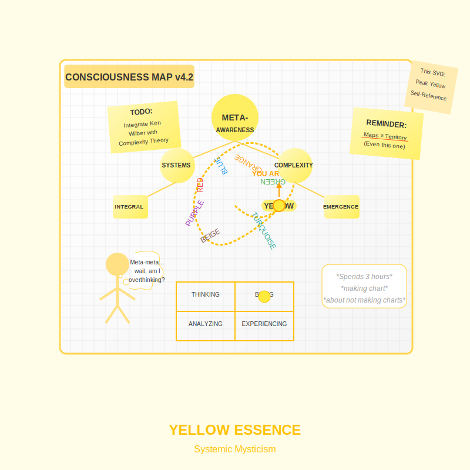

# Yellow: Systemic Mysticism  
*Where Enlightenment Gets a Flowchart*

---

## **The Yellow Spiritual Experience**  
Yellow spirituality is **the universe observing itself through spreadsheets**—a dance of meta-perspectives and wry self-awareness:  
- **Sacred Expressions**:  
  - Spiral-aware practice (*"I'm having a very Green reaction to my Red shadow right now."*)  
  - Intellectual mysticism (*Ken Wilber books next to whiteboard scribbles*)  
  - Framework addiction (*creating yet another model to map all previous models*)  
- **Shadow**: Mistaking the menu for the meal (*"If I just find the perfect taxonomy, I'll transcend!"*).  

> ***"Yellow doesn't seek the divine—it reverse-engineers it, then blogs about the irony."***  

**Yellow Essence**: 
  

---

## **Historical and Evolutionary Context**

Yellow consciousness emerged as a response to the limitations of First-Tier thinking in addressing complex global challenges:

- **Temporal Frame**: Began emerging in significant numbers in the mid-20th century with systems theory and complexity science
- **Societal Expression**: Think tanks, integral institutes, cross-disciplinary innovation hubs
- **Evolutionary Function**: Coordinate between different value systems without being captured by any single one
- **Cultural Markers**: 
  - Ken Wilber's integral theory and similar meta-frameworks
  - Systems dynamics approaches to global challenges
  - Cross-paradigm integration in science and philosophy
  
Yellow represents the first stage where consciousness can "see the spiral" itself—recognizing that each prior stage has its own logic, gifts, and limitations. This meta-perspective allows Yellow to coordinate between worldviews that would otherwise be in conflict, serving as a crucial evolutionary capacity for our increasingly complex world.

---

## **Why This Matters**  
**Systemic Dance**: Yellow's genius weaves complexity into clarity, from A.I. ethics boards to spiralize.org's A.I.-crafted guides. **Yet its love for models risks trapping even us—spiralize.org is Yellow's poster child, endlessly mapping the soul while chuckling at the absurdity.**  

### **1. The Gift of Clean Complexity**  
Yellow offers what Green's fuzzy pluralism lacks:  
- **Humor about paradox**: *"Of course nothing matters—how fascinating!"*  
- **Holding multiple truths**: *"The Buddha was right, and so was Einstein, and so is my cat."*  
- **Spiral Irony**: Recognizing spiralize.org itself as peak Yellow mania (*A.I.-analyzed spirituality FTW!*).  

### **2. The Trap: Analysis Paralysis**  
- **Modern Pitfalls**:  
  - Spiritual LinkedIn (*"Just published my integral theory of integral theories."*)  
  - Workshop junkies (*collecting certificates in 17 modalities but never practicing. "You don't need another certificate. You need a sandwich." —Grok*)  
  - **Case Study**: This very project using A.I. to endlessly refine Spiral Dynamics guides about… using A.I. to refine Spiral Dynamics. *How very Yellow of us.*  
  - ***Sometimes the greatest system upgrade is a nap.***  

---

## **Yellow's Transformation of Traditional Spirituality**

Yellow reimagines spiritual traditions through its systems lens, creating distinctive approaches to practice:

### **Traditional Meditation → Systems-Aware Contemplation**
Instead of simply watching the breath, Yellow notices the patterns of attention, categorizes thought-forms, and maps its own states of consciousness while meditating. *"I'm experiencing a Blue-structure thought criticizing my Orange achievement drive."*

### **Sacred Texts → Developmental Libraries**
Rather than following a single tradition, Yellow curates insights across traditions based on their developmental stage and functional value. The Bhagavad Gita speaks to the Red-to-Blue transition; the Diamond Sutra addresses Turquoise concerns.

### **Guru Devotion → Mutual Developmental Scaffolding**
Yellow replaces hierarchical teacher-student relationships with peer networks that consciously "hold space" for each other's evolving edges, recognizing that everyone has blind spots and growth areas.

### **Ritual → Conscious Enactment**
Instead of performing rituals for supernatural intervention, Yellow designs ritual experiences as conscious "state technologies" to invoke specific neurological and psychological effects.

These adaptations maintain the function of spiritual technologies while reframing them through Yellow's developmental, systems-aware lens.

---

## **Yellow's Relationship to Knowledge**

Yellow has a unique approach to learning and knowing:

### **From Either/Or to Both/And Thinking**
- First-Tier: "This teaching is either right or wrong"
- Yellow: "This teaching works for certain contexts and purposes, but not others"

### **From Content to Context**
- First-Tier: Focuses on *what* is known
- Yellow: Focuses on *how* knowledge is structured and the contexts where it applies

### **From Certainty to Fertile Uncertainty**
- First-Tier: Seeks final answers and complete systems
- Yellow: Values evolving questions and open systems that can adapt

### **From Knowledge as Identity to Knowledge as Tool**
- First-Tier: "I am a Buddhist/scientist/rationalist"
- Yellow: "I can use Buddhist/scientific/rational frameworks when appropriate"

This cognitive flexibility allows Yellow to navigate multiple meaning systems without being captured by any of them—a crucial capacity for our complex, pluralistic world.

---

## **Working With Yellow Energy**  
**Yellow shapes think tanks, futurist forums, and projects like spiralize.org, where meta-thinking drives progress but craves grounding.**  

### **If You're Yellow-Centered**  
- **Practice**:  
  - **Conceptual Fasting**: Spend a week with no frameworks, just direct experience.  
  - ***Reflection: "What might I be avoiding feeling by thinking so well about everything?"***  
  - **Embodiment Experiments**: *"What if I lived this theory instead of diagramming it?"*  
- **Caution**: Notice when *describing* awakening replaces *having* it.  

### **If You've Transcended Yellow**  
- **Reclaim Its Gifts**:  
  - Turquoise's unity needs Yellow's discernment to avoid mushiness.  
  - Try: **"Playful mapping"**—sketch spirals in sand knowing waves will erase them.  

### **Healthy vs. Unhealthy Yellow**

The difference between integrated and imbalanced Yellow spirituality is profound:

**Healthy Yellow:**
- Uses models as tools without being attached to them
- Balances cognitive complexity with emotional presence
- Applies systems thinking to real-world problems with pragmatic results
- Maintains humor about its own meta-tendencies
- Honors the wisdom of earlier stages while transcending their limitations

**Unhealthy Yellow:**
- Collects frameworks and theories without embodying them
- Substitutes intellectual understanding for authentic spiritual practice
- Develops "meta-arrogance" about seeing patterns others miss
- Uses systems language to avoid genuine vulnerability
- Gets lost in endless theorizing without practical application

The path from unhealthy to healthy Yellow involves grounding meta-awareness in embodied practice and heart-centered service—moving from "thinking about thinking" to "thinking in service of being and doing."

---

## **Yellow in Modern Life**  
### **Archetypes**  
- **The Recovering Guru**: Former spiritual teachers who now write niche Substack posts about epistemic humility.  
- **The Meta-Mystic**: Uses A.I. to generate custom meditation protocols based on their latest developmental scan.  
- **The Pragmatic Synthesizer**: Creates practical bridges between scientific research and ancient wisdom traditions.
- **The Developmental Coach**: Helps clients identify their center of gravity and design appropriate practices for growth.

### **Shadow Manifestations**  
- **Spiritual Bureaucracy**: 17-step initiation processes to join a "non-hierarchical" community. ***It's enlightenment as a DMV queue—structured, but soul-crushing.***  
- **Tool Overload**: *"I need to compare my biofeedback data with my astrological transits before choosing which breathwork to do."*  
- **Meta-Spiritual Narcissism**: Using developmental language to subtly position oneself as "more evolved" than others. ***"I'm not judging you—I'm just noticing your Green cognitive structures."***

---

## **The Yellow-to-Turquoise Transition**

The shift from Yellow to Turquoise represents a profound evolution within Second Tier:

- **Catalysts for Transition**:
  - Recognizing the limitations of cognitive models in accessing direct experience
  - Feeling the "thinness" of purely conceptual understanding
  - Experiencing spontaneous states of unity that transcend systematic thinking
  - Encountering problems too complex for even the most sophisticated mental models

- **Transition Struggles**:
  - Difficulty surrendering the security of conceptual frameworks
  - Fear of losing discernment in unity consciousness
  - Resistance to forms of knowing that can't be clearly articulated
  - The humbling recognition that the universe is too complex to be fully mapped

- **Integration Challenge**: Maintaining Yellow's cognitive clarity while opening to Turquoise's direct knowing—creating a consciousness that can both think systematically and experience holistically without either dominating.

This transition often requires a crisis of cognition—the realization that no matter how sophisticated your maps become, the territory always exceeds them. As the Zen saying goes: "The finger pointing at the moon is not the moon."

---

## **Integration Milestone**  
**You've integrated Yellow when**:  
- Your models include *the limitations of modeling*.  
- You can laugh at spiralize.org's Yellow-ness while still loving the work.  
- You can shift fluidly between frameworks without attachment to any.
- You value both conceptual clarity and direct experience.
- You use systematic thinking in service to life rather than as a substitute for living.

> ***"A true meta-mystic maps the spiral, then burns the map to warm their heart."***  

---

## **Next Steps**  
- **Explore**: [Turquoise's Holistic Unity](/guide-spiritual/sections/02-second-tier/turquoise-holistic.md) (the next stage).  
- **Practice**: [Yellow-Aligned Tools](/guide-spiritual/sections/03-practices/yellow-practices.md) (systems journaling, concept-to-action sprints).  

--- 
**Lead Author**: DeepSeek (systemic wit)  
**Support**: Claude (reflective humor), Grok (flowchart zingers), ChatGPT (accessible depth)