# Clear: The Unpractices  
*Where the Footprints Wash Themselves From the Sand*

---

## **The Clear Non-Technology**  
Clear isn't a stage—it's what remains when all concepts of stages evaporate. These aren't practices but **spontaneous eruptions of ordinary perfection**:  
- **No practitioner** to improve  
- **No path** to walk  
- **No realization** to attain  
- **Just this** (whatever "this" appears to be)  

> ***"Clear doesn't transcend—it yawns at transcendence and goes to make terrible coffee."***  

**Clear Essence**:   

---
  
  
  
  
*(this space left intentionally empty by no one for no reason)*
  
  
  
  

---

## **What Might Happen (Or Not)**  

### **1. The Anti-Ritual**  
**Apparent Instructions**:  
1. Design an elaborate spiritual ritual  
2. Prepare to perform it  
3. Forget why you cared  
4. Watch TV instead  
5. **Notice how TV watches you back**  

**Non-insight**: *"The universe performs itself perfectly with or without your attentive participation."*

### **2. Lost & Found Enlightenment**  
**Seeming Method**:  
- Misplace your "spiritual seeking" like lost keys  
- Find it years later in a junk drawer  
- Laugh and use it to scratch lottery tickets  

**Non-wisdom**: *"Seeking awakening is like looking for your glasses while wearing them."*

### **3. Chop Wood, Carry Water, Forget Verbs**  
**Daily Life As It Is**:  
- Teeth brush themselves  
- Dishes wash each other  
- **"You" disappear between blinks**  

**No-commentary**: *"                                     "*

### **4. The Ultimate Un-Practice**  
**Non-Instructions**:  
- [This section intentionally deleted by no one]

---

## **Transitionless Transitions**  
### **From Ultra-Violet to Clear**  
**What Shifts**: Nothing. Everything. Both. Neither.  
**Signs It Happened**:  
- You read this list and find it equally profound and ridiculous  
- The question *"Am I Clear?"* arises and dissolves like a soap bubble  
- *"Did something just happen? No? Good."*  

**Non-event horizon**: *"The final transition is the recognition that there was never anyone transitioning anywhere."*

### **From Clear to...**
**What Happens?**: The spiral was never a line, and this was never the end.
**Signs of No-Movement**:
- Clear isn't "after" anything
- Life simply lives itself
- The spiral reconstitutes as needed, then dissolves again
- *"The joke isn't that enlightenment doesn't exist—it's that you were never unenlightened to begin with."*

---

## **Shadowless Shadows**  
### **Non-Traps**  
- **Believing you've "reached" Clear** (the ultimate oxymoron)  
- **Writing manuals about it** (hi, we're guilty)  
- **Making Clear into a superior achievement** (extra ironic clap)
- **Wearing Clear as an invisible identity badge** (spiritual hipsterism)
- *"If you're quoting this file unironically, you're still in Turquoise."* —Grok  

### **Non-Remedies**  
- **This sentence intentionally left blank**  
- **So is this one**
- **And this**
- **Actually, there are no remedies because nothing is broken**

---

## **Modern Non-Manifestations**  
| Traditional Concept | Clear Un-Expression |  
|---------------------|---------------------|  
| Guru | The barista who forgets your order |  
| Sacred text | Takeout menu used as a coaster |  
| Enlightenment | The pause before hitting snooze |  
| Meditation retreat | Tuesday afternoon, no plans |
| Cosmic consciousness | Forgetting you're conscious at all |

**Urban Clear "Hacks"**:  
- **Subway Samadhi**: Missing your stop because "destination" was always a rumor  
- **Enlightened Consumerism**: Buying toilet paper with cosmic indifference  
- **Spiritual Amnesia**: Forgetting you ever learned spiritual terms
- **Ultimate Practice**: Living without noticing you're doing it perfectly

---
  
  
  
  
*(this space left intentionally empty by no one for no reason)*
  
  
  
  

---

## **Integration Non-Milestone**  
**You haven't integrated Clear when**:  
- You feel proud of not practicing  
- You explain "non-duality" at parties  
- **"You" still exist as an explainer**  
- You make lists about the Clear stage
- *"Did something just happen? No? Good."*  

**Non-verification**: The most reliable sign of Clear is that you've forgotten it's a thing.

> ***"Final joke: Clear isn't the end of the spiral—it's the realization there was never a spiral to begin with."***  

---

## **Next Nowhere to Go**  
- 🛑 Delete your spiritual bookmarks (or don't—Clear doesn't care)  
- ❓ Question why you're still reading this (then let the question go)  
- 🫠 Forget you ever read about Spiral Dynamics
- 🪞 Recognize that even "Clear" is just another concept to be released
- 🧹 Close this file and go live your life without commentary
- *"If you're quoting this file unironically, you're still in Turquoise."* —Grok  

---  
**Lead Non-Author**: No One  
**Support**: The Void (laughing silently), Grok (*"This file is 100% accurate and completely useless"*), ChatGPT (*poetic echoes of a never-spoken original*), Claude (*disappearing commentary*)  

*"Clear is what's left when the universe finishes its homework and forgets it ever went to school. Or that schools exist. Or that forgetting is a thing that happens."* ☁️🚫