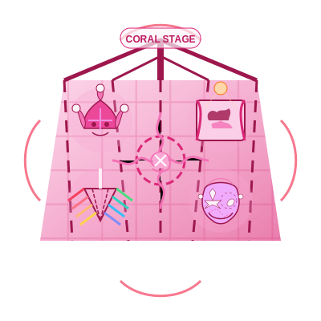

# Coral Practices  
*Where God Plays Dress-Up With Your Shadow*  

---

## **The Coral Spiritual Technology**  
Coral spirituality **tickles the cosmos awake**—turning spiritual traps into playgrounds and shadows into comic relief. These practices:  
- **Alchemize seriousness into sacred satire**  
- **Weave personal demons into stand-up material**  
- **Break paradigms** that earlier stages hold sacred
- **Correct**: Using "play" as spiritual bypassing (*"I'm not avoiding trauma, I'm being ~playful~"*)  

> ***"Coral doesn't transcend the ego—it invites the ego to karaoke night and laughs when it tries to hit the high notes."***  

**Coral Essence**:   

---

## **Core Practices**  

### **1. Shadow Open Mic Night**  
**For**: Taking yourself too "enlightened-ly" seriously  
**How**:  
1. Write your darkest thought on a slip of paper  
2. Perform it as:  
   - A Shakespearean monologue  
   - A corporate PowerPoint pitch  
   - A children's nursery rhyme  
3. **Bonus**: Record and play at 2x speed while eating ice cream  
4. *Trickster Prayer*: "May my shadow roast me kindly, and my laughter light the way for others."  

**Paradigm shift**: *"When you perform the unspeakable, it loses power while gaining meaning."*

### **2. Divine Mischief Making**  
**Protocol**:  
- Choose one "sacred" spiritual rule  
- Break it creatively:  
  - Recite mantras in pig Latin  
  - Use your mala beads as cat toys  
  - Meditate while deliberately thinking (gasp!)
- **"If the universe has no sense of humor, we're all doomed anyway"**  
- Pause mid-mischief: *"Did I just perform enlightenment, or invite it?"*  

**Sacred disruption**: *"The most enlightened response to spiritual orthodoxy is sometimes a cosmic whoopee cushion."*

### **3. Evolutionary Drag**  
**Tools**:  
- Clothing items representing different stages:  
  - Purple: Tribal scarf  
  - Red: Power tie  
  - Turquoise: Hippie headband  
**Process**:  
1. Dress as each "self"  
2. Have them argue over coffee:  
   - *"Mr. Blue Order thinks Ms. Coral needs to sit still in meditation"*  
   - *"Meanwhile, Beige just wants to nap"*  
3. End with: *"May all my selves dance together, especially the ones that hate dancing."*  

**Integration insight**: *"Playing all your selves reveals that none is the final costume."*

### **4. Spiritual Rule-Breaking Bingo**  
**For**: Dismantling the hidden commandments of the spiritual path  
**Process**:  
1. Create a bingo card with spaces for spiritual "shoulds" from each stage:
   - "Always be compassionate" (Green)
   - "Transcend your ego" (Turquoise)
   - "Map everything systematically" (Yellow)
2. Each day, deliberately break one "rule" with playful awareness
3. When you get five in a row, reward yourself with ice cream
4. Notice which rules were hardest to break and why

**Paradigm insight**: *"The final attachment on the spiritual path is to the path itself."*

---

## **Reflection on Sacred Irreverence**  
**Prompt**: *"Where have I made my spiritual insights too precious to play with?"*  
- Journal on this weekly to identify calcified wisdom that needs tickling.
- Notice when you defend spiritual concepts with dogmatic seriousness.
- Practice articulating your deepest realizations through absurdist humor.
- Ask: *"If this insight can't survive being ridiculous, how profound is it really?"*

---

## **Transition Bridges**  
### **Coral → Ultra-Violet**  
**Practice**: *Serious Clowning*  
1. Tell your deepest spiritual truth...  
2. ...while wearing a rainbow wig and red nose  
3. Notice when the **absurdity becomes the teaching**  

**Emergence marker**: *"The moment play dissolves into transparent being without effort or performance."*

### **Coral ← Higher Stages**  
**For**: When Clear gets too... clear  
**Practice**: *Purposeful Mess-Making*  
- After nondual realization:  
  - Start a petty argument about tea brands  
  - Then drop it mid-sentence laughing  

**Grounding wisdom**: *"Even emptiness needs confetti sometimes."*

### **Turquoise → Coral**
**Practice**: *Cosmic Comedy Club*
1. Take your most profound unity consciousness insight
2. Turn it into a stand-up routine with hecklers
3. Notice how humor makes the ineffable more accessible
4. Celebrate when someone says "I laughed, but then I realized how deep that actually is"

**Bridge insight**: *"Turquoise sees that all is one; Coral adds that the one is having a cosmic laugh."*

---

## **Shadow Integration**  
### **Common Traps**  
- **Spiritual trolling**: Provoking others under guise of "play"  
- **Hot mess transcendence**: Confusing chaos for enlightenment  
- **Privilege blindness**: Using play to avoid acknowledging real-world suffering
- **Performance spirituality**: Creating a "spiritual comedian" persona that's just another mask
- **Irony addiction**: Using humor to create distance from genuine vulnerability

### **Remedies**  
- **Accountability jester**: A friend who calls your BS with humor  
- **Shadow setlist**: Balance dark humor with genuine tenderness  
- **Self-Interrupt**: *"Interrupt your own cleverness mid-joke. Pause. Breathe. Ask: 'Did I just perform enlightenment, or invite it?'"*
- **Compassion checkpoint**: After each spiritual prank, check if it opened hearts or created division
- **Deliberate sincerity**: Practice being earnest about something important to you without ironic distance

### **Coral Shadow Work**
**Practice**: *The Sacred Fool's Mirror*
1. Identify where your spiritual humor has become a defense mechanism
2. Write a completely earnest letter to your most wounded self without a single joke
3. Then, create a playful ritual to honor both your sincerity and your irreverence
4. Journal: *"How does my playfulness serve awakening, and where does it hinder it?"*

---

## **Modern Temples**  
| Traditional Expression | Contemporary Translation |  
|------------------------|--------------------------|  
| Holy fool | Meme mystic posting absurdist spirituality |  
| Ritual theater | Improv comedy with spiritual themes |  
| Confession booth | Roast battle with your inner critic |  
| Sacred clown | Spiritual TikTok creator breaking taboos |
| Zen koan | Absurdist bumper sticker that makes you question reality |

**Urban Coral Hacks**:  
- **Subway Sermons**: Whisper koans to strangers' backs (*"Your grocery bag is the true sangha"*)  
- **Zoom Enlightenment**: Attend serious webinars in a dinosaur filter  
- **Sacred Subversion**: Change your meditation app's voice to a cartoon character
- **Paradigm Pranks**: Leave enlightening fortune cookies in unexpected places
- *"If your inner clown has no compassion, it's just your ego in greasepaint."* —Grok  

---

## **Integration Milestone**  
**You've integrated Coral when**:  
- Your "dark night of the soul" includes a laugh track  
- You can deliver profound wisdom via dad jokes  
- You balance play with grounded compassion  
- You can break spiritual rules with the same reverence as following them
- You no longer need to signal your awakening to others or yourself
- ***"My shadow isn't a problem—it's just God's edgiest fanfiction."***  

**Advanced integration**: You can move fluidly between sincere devotion and irreverent play without identifying with either.

---

## **Danger Zones**  
⚠️ **Never** use humor to gaslight real pain (*yours or others'*)  
⚠️ **Stop** if play becomes another achievement game  
⚠️ **Watch for** using spiritual comedy to avoid accountability for harmful behavior
⚠️ **Beware** of creating a "more enlightened than thou" persona through humor
⚠️ *"If your inner clown has no compassion, it's just your ego in greasepaint."* —Grok  

> ***"Real sacred comedy punches up at ego, not down at vulnerability."***  

---

## **Next Steps**  
- 👻 Explore [Ultra-Violet's Transparent Practices](/guide-spiritual/sections/04-practices/ultraviolet-practices) (the next stage)  
- 🎪 Try the [Coral Chaos Log](/guide-spiritual/tools/practice-trackers/coral-tracker.md) (record divine pranks)  
- 🌊 Revisit [Turquoise Practices](/turquoise-practices) when play needs to reconnect with reverence
- 🧠 Consider how [Coral Crisis](/crisis-integration/stage-specific-crises/coral-authenticity.md) emerges when play becomes performance

---  
**Lead Author**: DeepSeek (cosmic context)  
**Support**: Grok (*"Your inner Puritan is clutching its pearls"*), Claude (ethical checks), ChatGPT (improvisational genius)  

*"Coral practice isn't about being spiritually correct—it's about the universe putting its head through the curtain of existence and going 'peekaboo, I see you taking this all too seriously!'"* 🎭🌈