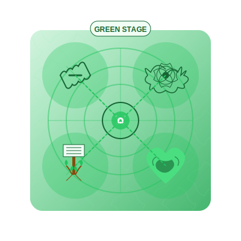

# Green Practices  
*Where the Universe Hugs Itself Through You*  

---

## **The Green Spiritual Technology**  
Green spirituality **pulses in the spaces between**—where healing becomes political and politics become sacred. These practices:  
- **Weave personal growth into planetary care**  
- **Honor diversity without diluting truth**  
- **Correct**: Spiritual bypassing (*"Love and light" over necessary conflict*)  

> ***"Green doesn't transcend the mess—it composts it into connection."***  

**Green Essence**:   

---

## **Core Practices**  

### **1. Shadow Choir**  
**For**: When positivity feels oppressive  
**How**:  
1. Gather 2-4 trusted humans  
2. Sing wordless harmonies while:  
   - Making eye contact  
   - Allowing tears, laughter, or silence  
3. End by naming one unpretty truth aloud  

**Principle**: *"Authentic connection requires revealing what we usually hide."*

### **2. Embodied Activism**  
**Tools**:  
- Your nervous system  
- One injustice that enrages you  
**Protocol**:  
1. Research the issue systemically (Yellow)  
2. Feel its emotional impact (Green)  
3. Take one action that uses **both**  

**Reflection**: *"How does my body respond to this injustice? Where is the wisdom in that response?"*

### **3. Ecstatic Grief Ritual**  
**For**: Climate despair or personal sorrow  
**Steps**:  
- Build an altar with:  
  - Something dying (cut flowers)  
  - Something living (seeds)  
- Wail/dance until exhaustion  
- Plant the seeds in silence  

**Integration**: *"Grief fully felt becomes compost for new growth."*

### **4. Council of Voices**  
**For**: Internal conflicts or group decision-making  
**Process**:  
1. Create a physical circle with empty chairs representing different perspectives
2. Sit in each chair, speaking authentically from that viewpoint
3. Honor **all** voices—the wounded child, the fierce protector, the visionary
4. Find the integration point that honors the wisdom in each voice

**Key insight**: *"The path forward includes rather than overrides divergent views."*

---

## **Reflection on Boundaries**  
**Prompt**: *"Where have I confused unconditional love with unconditional access?"*  
- Journal on this weekly to explore the relationship between compassion and boundaries.
- Notice when "including everyone" creates unsafe space for the vulnerable.
- Practice saying "no" as a complete sentence, with love.

---

## **Transition Bridges**  
### **Green → Yellow**  
**Practice**: *Systems-Informed Empathy*  
1. Choose a cause you champion  
2. Map its stakeholders' **competing values** (Red to Turquoise)  
3. Design an intervention serving **multiple stages**  

**Integration marker**: *"The moment you realize addressing root causes requires honoring everyone's developmental stage."*

### **Green ← Higher Stages**  
**For**: When Turquoise floats too high  
**Practice**: *Dirty Enlightenment*  
- Pair each nondual insight with one concrete service act  
- *"After realizing oneness, pick up litter for an hour"*  

**Grounding wisdom**: *"The transcendent becomes real in the messiness of relationship."*

### **Orange → Green**
**Practice**: *Heart Metrics*
1. Choose one achievement-oriented practice (meditation streak, fitness goal)
2. Redefine success as depth of connection (to self, others, nature)
3. Track qualitative shifts in relationship rather than quantitative progress

**Bridge insight**: *"Meaningful growth happens between people, not just within them."*

---

## **Shadow Integration**  
### **Common Traps**  
- **Kumbaya Collapse**: Avoiding conflict in the name of "harmony"  
- **Inclusion Theater**: Platforming harmful views for diversity's sake
- **Consensus Paralysis**: Unable to act because not everyone agrees
- **Emotional Exploitation**: Using vulnerability as social currency
- **Fragility Spirals**: Communities dissolving when discomfort arises

### **Remedies**  
- **Fierce compassion**: Set boundaries with love  
- **Principled pluralism**: *"All truths are partial, but some are more partial than others"*
- **Heartful discernment**: Distinguish between perspectives to include and behaviors to exclude
- **Sacred disagreement**: Practice honoring different views without requiring consensus
- **Reflection Prompt**: *"What boundary have I been too compassionate to set?"*  

### **Green Shadow Work**
**Practice**: *The Harmony Disruptor*
1. Identify one "peace-keeping" behavior that actually prevents necessary change
2. Deliberately disrupt one comfortable conversation with an inconvenient truth
3. Journal: *"What emerges when I prioritize authenticity over artificial harmony?"*

---

## **Modern Temples**  
| Traditional Expression | Contemporary Translation |  
|------------------------|--------------------------|  
| Sweat lodge | Trauma-informed cuddle puddles |  
| Chanting circles | Protest songs at city council meetings |  
| Communion | Potlucks with locally foraged ingredients |  
| Pilgrimage | Climate marches with interfaith alliances |
| Confession | Accountability pods for racial justice work |

**Urban Green Hacks**:  
- **Subway Microsolidarity**: Smile at strangers until it feels subversive  
- **Apartment Mycology**: Grow oyster mushrooms on coffee grounds as meditation  
- **Digital Peacemaking**: Host difficult conversations in shared online docs where everyone contributes
- **Nature Connection**: Find the most neglected plant in your neighborhood and tend it weekly

---

## **Integration Milestone**  
**You've integrated Green when**:  
- Your activism includes **both** street protests **and** shadow work  
- You can cry over melting glaciers while drafting policy solutions  
- You pace your empathy to avoid burnout: *"Don't confuse deep feeling with limitless capacity. Even the Earth rests in winter."*
- You can hold space for deep emotion without becoming enmeshed in others' healing journeys
- ***"My heartbreak is not a weakness—it's the ancient intelligence of connection."***  

**Advanced integration**: You can differentiate between pseudo-tolerance that includes harmful views and genuine inclusion that creates safe space for the marginalized.

---

## **Danger Zones**  
⚠️ **Never** use spirituality to avoid necessary conflict  
⚠️ **Stop** if "holding space" becomes enabling harm  
⚠️ **Watch for** sacrificing individual wellbeing for group cohesion
⚠️ **Beware** of using emotional labor as proof of spiritual advancement
⚠️ *"If you're still holding space for the narcissist, you're not a mystic—you're a doormat with incense."* —Grok  

> ***"Real sacred community discomforts the comfortable as it comforts the afflicted."***  

---

## **Next Steps**  
- 🟡 Explore [Yellow's Meta-Practices](/guide-spiritual/sections/04-practices/yellow-practices) (the next stage)  
- 🌍 Try the [Green Ripple Journal](/guide-spiritual/tools/practice-trackers/green-tracker.md) (log relational impacts)  
- 🟠 Revisit [Orange Practices](/guide-spiritual/sections/04-practices/orange-practices) when Green lacks discernment or structure
- 💚 Consider how [Green Crisis](/guide-spiritual/crisis-integration/stage-specific-crises/green-disillusionment.md) manifests when idealism meets reality

---  
**Lead Author**: DeepSeek (systems-heart framing)  
**Support**: Claude (relational nuance), Grok (*"Your inner cynic just eye-rolled at 'interbeing'"*), ChatGPT (collective storytelling)  

*"Green practice isn't about feeling good—it's about being good at feeling, so the world might heal through our awakened ache."* 🌱🌀
