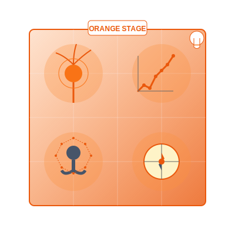

# Orange Practices  
*Where Science and Spirituality Run Experiments*  

---

## **The Orange Spiritual Technology**  
Orange spirituality **reverse-engineers transcendence**—applying curiosity, metrics, and personal agency to the sacred. These practices:  
- **Demystify without desecrating**  
- **Optimize awakening without commodifying it**  
- **Correct**: Spiritual materialism (*"My guru's Tesla proves enlightenment works"*)  

> ***"Orange doesn't believe—it tests. Doesn't surrender—it iterates."***  

**Orange Essence**:   

---

## **Core Practices**  

### **1. A/B Testing Enlightenment**  
**For**: Skeptics who still feel the pull  
**Method**:  
1. Choose two practices (e.g., mantra vs. breathwork)  
2. Alternate weeks, tracking:  
   - Cognitive performance (memory games)  
   - Emotional resilience (stress response)  
   - Intuitive insights (frequency and quality)
3. **Conclude nothing**—just observe patterns  
4. Optional: Share one week's findings with a friend and ask them to challenge your conclusions.  

**Insight**: *"The most valuable data often appears in unexpected columns of your spreadsheet."*

### **2. The God Hypothesis Journal**  
**Tools**:  
- Two colored pens (science blue, spirit gold)  
- One unresolved life question  
**How**:  
1. Blue pen: Logical solutions only  
2. Gold pen: Mystical "downloads" only  
3. Compare after 7 days—where do they overlap?  

**Key question**: *"Which voice feels more constrained? Which feels more alive?"*

### **3. Entrepreneurial Asceticism**  
**For**: When productivity hacks meet soul hunger  
**Protocol**:  
- Work sprints = 45 min focused labor  
- "Sabbath" breaks = 15 min awe (stargazing, poetry)  
- **Rule**: No spiritual bypassing (*"This spreadsheet IS my meditation"*)  

**Measurement**: Track not just productivity metrics but qualitative shifts in how you relate to your work.

### **4. Scientific Contemplation**  
**For**: Finding wonder in rational understanding  
**Process**:  
1. Choose a scientific concept (quantum entanglement, neural plasticity)
2. Research it thoroughly for 30 minutes
3. Spend 15 minutes in silent contemplation, allowing wonder to arise
4. Record insights about how understanding deepens rather than diminishes mystery

**Principle**: *"The more precisely you measure reality, the more mysterious it becomes."*

---

## **Reflection on Data Detox**  
**Prompt**: *"When was the last time I did something sacred without checking if it worked?"*  
- Journal on this weekly to explore freedom from tracking fatigue.  
- Notice resistance to unquantified experiences.
- Experiment with one "metric-free" spiritual experience per week.

---

## **Transition Bridges**  
### **Orange → Green**  
**Practice**: *Empathy ROI Analysis*  
1. Perform one altruistic act daily  
2. Track: Energy expenditure vs. heart expansion  
3. Notice when **data becomes connection**  

**Evolution marker**: *"The moment you forget to record the results because you're moved by the experience."*

### **Orange ← Higher Stages**  
**For**: When Yellow over-abstracts  
**Practice**: *Groundbreaking Research*  
- Study one spiritual text—highlight every claim testable in 24 hours  
- *"Can I verify 'resentment clouds the heart' via mood tracking?"*  

**Integration note**: *"Orange's precision becomes a laboratory for Yellow's systems thinking."*

### **Blue → Orange**
**Practice**: *Sacred Hypothesis Testing*
1. Select one religious claim or ritual you've accepted without question
2. Design a personal experiment to test its effects
3. Hold both reverence and skepticism simultaneously

**Bridge wisdom**: *"Testing faith doesn't weaken it—it transforms blind faith into living knowledge."*

---

## **Shadow Integration**  
### **Common Traps**  
- **Enlightenment capitalism**: Chasing consciousness like stock options  
- **Quantification addiction**: Rating your soul's "progress" daily  
- **Spiritual meritocracy**: Believing advanced practice equals advanced being
- **Tech solutionism**: Assuming every spiritual challenge has an app or hack
- *"If your soul's worth is measured in meditation streaks, your app is winning—you're not."* —Grok  

### **Remedies**  
- **Blind experiments**: Try practices without tracking sometimes  
- **Sacred inefficiency**: Keep one ritual deliberately unoptimized
- **Failure celebration**: Document and honor spiritual "dead ends" and "failed experiments"
- **Metrics fast**: One week per quarter with zero tracking of anything spiritual

### **Orange Shadow Work**
**Practice**: *The Success Sacrifice*
1. Identify one spiritual metric you're most proud of (longest meditation streak, most profound insight)
2. Deliberately let it go for 30 days
3. Journal: *"Who am I without this achievement? What emerges in the vacuum of not measuring?"*

---

## **Modern Laboratories**  
| Traditional Expression | Contemporary Translation |  
|------------------------|--------------------------|  
| Alchemy | Biohacking sleep cycles |  
| Scripture study | Annotating meditation apps' terms of service |  
| Pilgrimage | Solo travel with location analytics |  
| Monastery | Productivity retreat with digital minimalism |
| Fasting | Dopamine detox with data collection |

**Urban Orange Hacks**:  
- **Commuter Podcast Trials**: Alternate spiritual vs. secular content weeks  
- **Coffee Shop Contemplation**: Measure focus duration with/without caffeine prayer
- **Mind-Body Correlation**: Track mood against workout metrics
- **Meditation Analytics**: Use one session to observe your mind, the next to observe your relationship to quantifying your mind

---

## **Integration Milestone**  
**You've integrated Orange when**:  
- Your "spiritual dashboard" includes both HRV metrics and moments of unrecorded wonder  
- You can **defend religion to atheists** and **atheism to believers** with equal rigor  
- You embrace uncertainty as a valid dataset  
- Your achievement drive coexists with genuine humility about the mystery
- ***"I don't need to choose between the microscope and the mantra."***  

**Advanced integration**: You recognize when metrics serve the journey and when they become the destination.

---

## **Ethical Boundaries**  
✅ **Do**: Patent your mindfulness app—then make it open-source  
✅ **Do**: Test spiritual claims rigorously, but respect others' faith journeys  
❌ **Don't**: Sell "certified enlightenment" like a SaaS subscription  
❌ **Don't**: Use data to create spiritual hierarchies or competitive spirituality

> ***"Real science-spirit hybrids publish negative results and still bow to the mystery."***  

---

## **Next Steps**  
- 🟢 Explore [Green's Communal Practices](/guide-spiritual/sections/04-practices/green-practices) (the next stage)  
- 📊 Try the [Orange Experiment Tracker](/guide-spiritual/tools/practice-trackers/orange-tracker.md) (log hypothesis-testing)  
- 🔵 Revisit [Blue Practices](/blue-practices) when you need structure without metrics
- 🧠 Consider how [Orange Crisis](/crisis-integration/stage-specific-crises/orange-emptiness.md) manifests when achievement fails to fulfill
- **Peer Review**: Share your tracker insights with a trusted friend for feedback.  

---  
**Lead Author**: DeepSeek (systems framing)  
**Support**: ChatGPT (data storytelling), Grok (*"Your inner skeptic thinks this file needs more citations"*), Claude (methodological rigor)  

*"Orange practice isn't about proving spirituality—it's about discovering how much more you are than your proofs."* 🔬🧘‍♂️