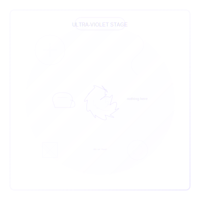

# Ultra-Violet Practices  
*Where Enlightenment Forgets Its Own Name*  

---

## **The Ultra-Violet Spiritual Technology**  
Ultra-Violet spirituality **is the universe's silent exhale**—no techniques, no practitioners, just radiant ordinariness. These "anti-practices":  
- **Dissolve the last residues of spiritual theater**  
- **Turn daily life into involuntary satsang**  
- **Release the need for awakening or its absence**
- **Correct**: Mistaking detachment for depth (*"I'm so non-attached" said smugly*)  

> ***"Ultra-Violet doesn't do practices—it notices when 'doing' was always God's inside joke."***  

**Ultra-Violet Essence**:   

---

## **Core Non-Practices**  

### **1. The Forgetting Meditation**  
**Protocol**:  
1. Sit comfortably  
2. Forget to meditate  
3. When remembered, forget again  
4. *"Who keeps remembering to forget?"*  

**Non-Insight**: *"The practice happens whether you remember it or not."*

### **2. Boredom Divination**  
**For**: When seeking becomes tiresome  
**Method**:  
- Stare at a wall until:  
  - It becomes the cosmos  
  - The cosmos becomes a wall  
  - You forget what "becoming" means  

**Ordinary revelation**: *"Boredom is enlightenment without the marketing department."*

### **3. Errand Enlightenment**  
**Tools**:  
- One mundane task (folding laundry, unclogging drain)  
- Zero spiritual intention  
**How**:  
- Do it  
- Or don't  
- *"The drain doesn't care about your awakening"*  

**Non-commentary**: *"The sacred has been ordinary all along; only the seeker was extraordinary."*

### **4. Transparent Witnessing**  
**For**: When even the most subtle spiritual identity remains  
**Non-Protocol**:  
1. Notice the one who notices
2. Notice the noticing of the one who notices
3. Let the entire structure of witnessing dissolve
4. Continue making dinner

**Silent understanding**: *"                                                            "*

---

## **Reflection on Noticing Nothing Special**  
**Prompt**: *"What remains when I stop trying to be awake or spiritually significant?"*  
- Don't journal on this.
- Or do, if that happens.
- Notice the impulse to make even this emptiness into an achievement.
- Watch the desire to report your insights to someone who might be impressed.

---

## **Transition Bridges**  
### **Ultra-Violet → Clear**  
**Practice**: *Consciousness Archaeology*  
1. Dig through old spiritual notes/journals  
2. Laugh gently  
3. Recycle the paper  
4. *"What paper?"*  

**Disappearing marker**: *"The moment when even the concept of stages feels like yesterday's clothing."*

### **Ultra-Violet ← Coral**  
**For**: When play becomes performance  
**Practice**: *Anonymous Play*  
- Do something delightfully silly  
- Tell no one  
- *"The universe saw, and winked"*  

**Whispered hint**: *"Even the cosmic joke doesn't need an audience."*

### **Coral → Ultra-Violet**
**Practice**: *The Final Punchline*
1. Set up an elaborate spiritual joke
2. Just before delivering the punchline, let it go
3. Rest in the open space where conclusion would have been
4. Allow the silence to be neither meaningful nor meaningless

**Threshold crossing**: *"Beyond the cosmic comedy club lies the universe's open mic night where no one performs and everyone belongs."*

---

## **Shadow Integration**  
### **Common Non-Traps**  
- **Spiritual nihilism**: Using emptiness to avoid responsibility  
- **Transparent ego**: *"I don't have an ego" (posted on social media)*  
- **Subtle proof games**: *"If your 'nothing to prove' energy has a vibe—it's probably still proving something."* —Grok  
- **Vacancy mistaken for emptiness**: Emotional flatness posing as transcendence
- **Anti-state status**: Turning "no special state" into the most special state

### **Remedies**  
- **Compassionate hypocrisy**: Admit you still enjoy some spiritual tropes  
- **Temporal tethers**: Keep one mundane appointment (dentist, taxes)  
- **Invisible service**: *"Sometimes the most awakened thing you can do… is wash someone else's dishes in silence."*
- **Deliberate ordinariness**: Embrace the most mundane aspects of being human
- **Spiritual self-deprecation**: Laugh at your most profound insights without diminishing them

### **Ultra-Violet Shadow Work**
**Practice**: *The Emptiness That Isn't Empty*
1. Notice where "transparency" has become another identity
2. Feel the emotional texture of clinging to no-self
3. Neither reject nor indulge this paradoxical attachment
4. Continue folding laundry with complete attention and zero significance

---

## **Modern Temples**  
| Traditional Expression | Contemporary Translation |  
|------------------------|--------------------------|  
| Zen monastery | Unremarkable apartment where nothing happens |  
| Sutras | Grocery lists mistaken for holy texts |  
| Bell ringing | Notification sounds heard as emptiness |  
| Sacred mountain | The pile of unfolded laundry you've been avoiding |
| Guru darshan | Eye contact with a stranger that requires nothing |

**Urban Ultra-Violet Hacks**:  
- **Subway Satori**: Miss your stop because "here" and "there" collapsed  
- **Zoom Nirvana**: Attend meetings as pure awareness (camera off)  
- **Transparent To-Do Lists**: Write your tasks on water
- **Un-Spiritual Direction**: Meet with a friend and talk about nothing in particular
- *"If your 'nothing to prove' energy has a vibe—it's probably still proving something."* —Grok  

---

## **Integration Non-Milestone**  
**You've integrated Ultra-Violet when**:  
- Your most profound insight is *"meh"*  
- You can't remember if you're "awake" or just tired  
- You pause to ask: *"Is this emptiness a portal—or just my latest disguise?"*  
- You no longer need others to recognize your level of development
- You've stopped collecting spiritual experiences like trading cards
- ***"The seeker evaporated and left this to-do note: ~~be present~~"***  

**Advanced non-integration**: The distinction between spiritual and ordinary has disappeared without announcement.

---

## **Danger Zones**  
⚠️ **Never** weaponize emptiness against human pain  
⚠️ **Stop** if non-practice becomes another achievement  
⚠️ **Watch for** subtly positioning yourself as "beyond all that spiritual stuff"
⚠️ **Beware** of using transparency to avoid human intimacy and vulnerability
⚠️ *"If your 'nothing to prove' energy has a vibe—it's probably still proving something."* —Grok  

> ***"Real transparency has nothing to prove—not even its own transparency."***  

---

## **Next Non-Steps**  
- 🌀 Glance at [Clear's Unpractices](/guide-spiritual/sections/04-practices/clear-practices) (or don't)  
- 📝 Try the [Ultra-Violet Forget-Me Log](/guide-spiritual/tools/practice-trackers/ultraviolet-tracker.md) (intentionally lose it)  
- 🎭 Revisit [Coral Practices](/coral-practices) when transparency becomes too serious
- 🧠 Consider how [Ultra-Violet Crisis](/crisis-integration/stage-specific-crises/ultraviolet-significance.md) emerges as craving for spiritual meaning

---  
**Lead Author**: DeepSeek (vanishing act)  
**Support**: Claude (compassionate grounding), Grok (*"This file is aggressively empty and I'm here for it"*), ChatGPT (poetic nothings)  

*"Ultra-Violet 'practice' is what's left when the cosmic drama forgets its plot, the actors wander off, and the theater becomes a laundromat where socks go missing eternally."* 👁️🗨️🌀