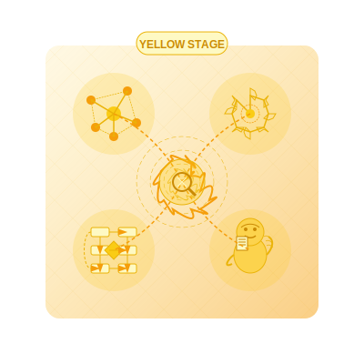

# Yellow Practices  
*Where Enlightenment Gets a Flowchart*  

---

## **The Yellow Spiritual Technology**  
Yellow spirituality **meta-analyses the sacred**—mapping, modeling, and laughing at its own mappings. These practices:  
- **Hold multiple truths simultaneously** without collapsing into relativism  
- **Spot developmental patterns** in personal and collective awakening  
- **Correct**: Mistaking the menu for the meal (*endless spiral diagrams*)  

> ***"Yellow doesn't seek the divine—it reverse-engineers God's source code, then questions the compiler."***  

**Yellow Essence**:   

---

## **Core Practices**  

### **1. Spiral Journaling**  
**For**: Integrating multiple "selves" across stages  
**How**:  
1. Identify a triggering event  
2. Write responses from **three stage perspectives** (e.g., Red's rage, Blue's morality, Green's empathy)  
3. Synthesize with Yellow's **meta-awareness**  
4. Reflect: *"What's the system behind how I choose my systems?"*  

*Example*:  
🔴 *"That idiot should be fired!"*  
🔵 *"Rules were clearly violated here."*  
🟢 *"Maybe they were having a trauma response?"*  
🟡 *"Notice how each truth partials a larger pattern..."*  

**Integration insight**: *"The goal isn't to choose the 'right' perspective, but to dance between them with strategic flexibility."*

### **2. Framework Fasting**  
**For**: When models replace direct experience  
**Protocol**:  
1. For 7 days:  
   - No spiritual terminology  
   - No developmental theory  
   - Describe experiences in plain language  
2. Notice what remains when **the map dissolves**  
3. Observe your withdrawal symptoms from conceptual frameworks

**Key question**: *"What emerges in the space between my explanatory systems?"*

### **3. The Anti-Guru Game**  
**Tools**:  
- Your spiritual convictions  
- One trusted skeptic friend  
**Rules**:  
1. Explain your deepest insight  
2. Have them poke holes for 10 minutes  
3. Switch roles  
4. **Winner**: Whoever laughs hardest at their own certainty  

**Principle**: *"True systemic wisdom is willing to question itself without losing its structural integrity."*

### **4. Meta-Meditation**  
**For**: When awareness gets trapped in its own complexity  
**Process**:  
1. Set timer for 20 minutes
2. Observe your thoughts arising
3. Categorize each thought by its developmental stage
4. Notice the part of you that's doing the categorizing
5. Watch the watcher watching the watcher (recursive awareness)

**Advanced variation**: *"Notice which stage of development you use to escape developmental awareness when it becomes uncomfortable."*

---

## **Reflection on Cognitive Elegance**  
**Prompt**: *"Where am I complicating spiritual understanding to avoid direct experience?"*  
- Journal on this weekly to explore your relationship with complexity.
- Notice which insights you turn into frameworks rather than live from.
- Practice articulating your most complex understandings in language a 10-year-old could grasp.

---

## **Transition Bridges**  
### **Yellow → Turquoise**  
**Practice**: *Embodied Systems*  
1. Choose one abstract concept (e.g., "nonduality")  
2. Express it through:  
   - Movement  
   - Cooking  
   - Bad abstract art  
3. **"If I can't dance it, do I really know it?"**  

**Emergence marker**: *"The moment systems thinking shifts from cognitive construction to intuitive perception."*

### **Yellow ← Higher Stages**  
**For**: When Coral gets too ungrounded  
**Practice**: *Serious Systems Play*  
- Create the most elaborate spiral model possible...  
- ...then turn it into a board game with silly rules  

**Grounding wisdom**: *"Even profound complexity can be approached with lightness and play."*

### **Green → Yellow**
**Practice**: *Systemic Empathy Mapping*
1. Choose a social issue you deeply care about
2. Map all stakeholders and their competing values
3. Design interventions that honor developmental diversity
4. Check: Does your solution require everyone to be at your developmental stage?

**Bridge insight**: *"True inclusion requires understanding the developmental logic of positions you disagree with."*

---

## **Shadow Integration**  
### **Common Traps**  
- **Analysis Paralysis**: 47 tabs open on consciousness studies  
- **Spiritual LinkedIn**: Performing complexity for status  
- **Hyper-Objectivity**: *"If your heart isn't in the dataset, you might be modeling instead of living."*
- **Meta-Superiority**: Using developmental theory to rank others as "less evolved"
- **Complexity Addiction**: Needing ever more intricate models to feel spiritually satisfied

### **Remedies**  
- **Stupid Wisdom**: Explain awakening using only grocery metaphors  
- **Conceptual Carnivore Diet**: One spiritual text per month, deeply digested
- **Elegance Practice**: Reframe complex models in 10 words or less
- **Developmental Humility**: Study one "primitive" tradition with genuine openness
- **Meta-Transparency**: "I notice I'm using this framework to avoid feeling X"

### **Yellow Shadow Work**
**Practice**: *The Beginner's Mind Experiment*
1. Identify your most sophisticated spiritual understanding
2. Find a setting where you're a complete novice (new hobby, unfamiliar culture)
3. Journal: *"What does my beginner's mind reveal about the limitations of my expertise?"*

---

## **Modern Dojos**  
| Traditional Expression | Contemporary Translation |  
|------------------------|--------------------------|  
| Monastery library | Obsidian vault of interconnected notes |  
| Koan study | Debugging life via systems theory |  
| Guru-disciple | Mentorship via mutual peer review |  
| Esoteric teachings | GitHub repositories with spiritual algorithms |
| Wisdom transmission | Interdisciplinary study groups with rotating facilitators |

**Urban Yellow Hacks**:  
- **Subway Metacognition**: Track which stages dominate your rush-hour thoughts  
- **Coffee Shop Taxonomy**: Categorize patrons' values without judging
- **Recursive Reflection**: Set up mirrors to see yourself seeing yourself
- **Meta-Game Navigation**: Turn daily interactions into a developmental role-playing game
- *"If your inner spreadsheet thinks it's enlightened—give it a hug and unplug the Wi-Fi."* —Grok  

---

## **Integration Milestone**  
**You've integrated Yellow when**:  
- Your "spiritual practice" includes **both** integral calculus **and** staring at clouds  
- You can passionately debate models while knowing they're provisional  
- You weave heart and mind into your meta-perspective  
- You can detect the developmental stage of a perspective without judging its value
- You feel genuine respect for pre-Yellow wisdom traditions
- ***"I don't believe my thoughts—I curate them."***  

**Advanced integration**: You can switch between systemic complexity and childlike simplicity without effort or pretense.

---

## **Danger Zones**  
⚠️ **Never** use developmental theory to manipulate others  
⚠️ **Stop** if mapping replaces living  
⚠️ **Watch for** using "meta-awareness" to bypass emotional processing
⚠️ **Beware** of creating such complex spiritual models that no one can falsify them
⚠️ *"If your inner spreadsheet thinks it's enlightened—give it a hug and unplug the Wi-Fi."* —Grok  

> ***"Real meta-awareness smiles at its own cleverness—then gets dirt under its nails."***  

---

## **Next Steps**  
- 🩵 Explore [Turquoise's Holistic Practices](/guide-spiritual/sections/04-practices/turquoise-practices) (the next stage)  
- 📈 Try the [Yellow Meta-Tracker](/guide-spiritual/tools/practice-trackers/yellow-tracker.md) (log pattern recognition)  
- 💚 Revisit [Green Practices](/green-practices) when systemic thinking becomes too detached
- 🧠 Consider how [Yellow Crisis](/crisis-integration/stage-specific-crises/yellow-complexity.md) manifests when complexity overwhelms

---  
**Lead Author**: DeepSeek (systems architecture)  
**Support**: Claude (epistemic humility), Grok (*"Your inner grad student wants to cite this file"*), ChatGPT (accessible complexity)  

*"Yellow practice isn't about reaching conclusions—it's about developing a more interesting set of questions."* 🟡🧩