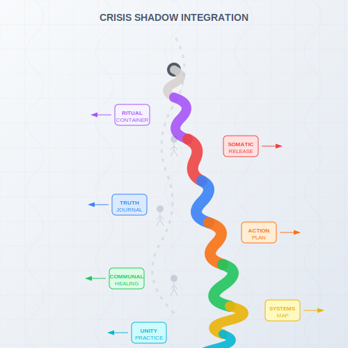

# Crisis & Shadow Integration  
*Where Breakdowns Become Breakthroughs*  

---

## **The Spiral of Falling Apart**  
Spiritual crises **aren't detours—they're the path itself** rewiring your operating system. *"If your shadow is knocking, stop meditating and answer the damn door."* —Grok  
This section explores:  
- **Stage-specific dark nights** (Red's rage, Blue's doubt, Green's disillusionment)  
- **Tools for metabolizing shadow** (somatic, emotional, cognitive)  
- **Integration frameworks** that honor both psychology and spirituality
- **When to seek help** (vs. spiritualizing mental health needs)  

> ***"Your darkest hour is just your current stage's software crashing—reboot takes courage, not transcendence."***  

**Crisis Spiral**: 

---

## **Why Crises Matter**  

### **1. Necessary Disintegration**  
| Stage | Crisis Purpose |  
|-------|----------------|  
| **Purple** | Shatters blind tradition |  
| **Red** | Channels fury into power |  
| **Blue** | Dissolves rigid certainty |
| **Orange** | Reveals achievement's emptiness |
| **Green** | Exposes toxic positivity |  
| **Yellow** | Breaks conceptual frameworks |
| **Turquoise** | Grounds cosmic inflation |

### **2. Shadow as Fuel**  
- **First-Tier**: Personal demons → gifts (Red's rage → courage)  
- **Second-Tier**: Collective shadows → service (Yellow's analysis → systemic healing)  
- **Third-Tier**: Spiritual shadows → play (Coral's nihilism → sacred absurdity)

### **3. The Bypass Trap**  
- **Spiritualizing pain**: *"This depression is just illusion"*  
- **Developmental truth**: *"This depression is Purple's grief unmet"*  
- **Integration insight**: *"The fastest way up is through"*

### **4. Evolutionary Tension**
- Crises often signal **transition between stages**
- Most painful at the **center of gravity** shift
- Requires **both release of old identity** and **embrace of new capacity**
- *"The chrysalis phase isn't pretty, but without it, no butterfly"*

---

## **How to Use This Section**  

### **If You're In Crisis Now**  
1. **Locate your stage**: Use the [Spiral Diagnostics](/tools/spiral-diagnostics.md) tool  
   - *Crisis may not match your usual stage. You might express Red rage during a Yellow reframe spiral—and that's normal. Start where the pain lives.*  
2. **Stage-specific first aid**:  
   - [Red Emergency Protocol](/red-rage.md)  
   - [Blue Faith Crisis](/blue-doubt.md)  
   - [Orange Achievement Collapse](/orange-emptiness.md)
   - [Green Disillusionment](/green-disillusionment.md)
3. **Professional support**: Therapists familiar with spiritual emergence  
4. **Crisis companions**: Find someone who can hold space without trying to "fix" you

### **If You're Supporting Others**  
- **Stage-aligned interventions**:  
  - **Purple**: Ritual containers, ancestral reconnection
  - **Red**: Physical catharsis, boundary reinforcement
  - **Blue**: Sanctioned questioning within familiar frameworks
  - **Orange**: Empirical evidence + self-agency tools  
  - **Green**: Communal witnessing, shared vulnerability
  - **Yellow**: Mapping the crisis within developmental context
  - **Turquoise**: Nondual grounding with embodied presence
- **Key principle**: *"Meet them where they are, not where you think they should be"*

### **Universal Crisis Tools**  
- **Somatic release**: Tremoring, primal sound, breath work
- **Shadow journaling**: Dialogue with inner antagonists  
- **Rhythm reset**: Align sleep/meals to circadian rhythms  
- **Nature immersion**: Primal reconnection to something larger
- **Creative expression**: Art, music, dance to express what words cannot
- **Movement practices**: Yoga, tai chi, dance to process through the body

---

## **Crisis Stages and Integration Paths**

### **The Descent Phase**
- **Recognition**: Acknowledging that something fundamental is breaking down
- **Surrender**: Letting go of control attempts
- **Disintegration**: Old identity structures dissolve
- **Void**: The empty space of not-knowing

### **The Pivot Point**
- **Stillness practice**: Being present with emptiness
- **Witnessing**: Observing without judgment
- **Resource anchoring**: Connecting to what remains stable

### **The Ascent Phase**
- **Meaning-making**: Finding purpose in the breakdown
- **Reintegration**: Building new, more inclusive structures
- **Embodiment**: Living from the new understanding
- **Service**: Using the experience to help others

---

## **Danger Signs**  
🚨 **Seek professional help if**:  
- Suicidal ideation persists  
- Reality testing falters (psychosis signs)  
- Basic self-care becomes impossible  
- Self-harm or harm to others feels compelling
- Prolonged dissociation disrupts daily functioning
- Substance use escalates to manage symptoms

> ***"Even the Buddha needed asceticism before middle way—your crisis isn't failure, it's data."***  

---

## **Integration Milestones**  
**You're through when**:  
- Your shadow material becomes **teaching fuel**  
- You can **honor the crisis** without retraumatizing yourself  
- The breakdown feels like a **necessary chapter** in your development
- You've developed **greater capacity** to hold complexity and paradox
- You can hold both the wisdom gained **and** the pain experienced
- You reflect: *"What truth did I learn that only suffering could teach me—without needing to suffer again?"*  
- ***"That breakdown? Just my soul's software update."***  

---

## **Professional Support Guide**

### **When to Consider Therapy**
- Crisis persists despite self-help approaches
- Functioning significantly impaired for >2 weeks
- History of trauma being triggered
- Significant relationship disruption

### **Types of Support**
- **Transpersonal therapists**: Bridge psychological and spiritual dimensions
- **Somatic practitioners**: Access body-stored trauma and emotion
- **Integration specialists**: Help process psychedelic or mystical experiences
- **Crisis peers**: Those who've navigated similar territory

### **Finding Right-fit Support**
- Ask about familiarity with developmental models
- Inquire about approach to spiritual experiences
- Trust your intuition about the connection
- *"The best therapist honors both your humanity and your divinity"*

---

## **What's Ahead**  
- 🔥 [Stage-Specific Crises](/stage-specific-crises/) (from Beige to Clear)  
- 🛠️ [Integration Tools](/integration-tools.md) (somatic to cosmic)  
- ☎️ [Crisis Resources](/crisis-protocols.md) (when to call professionals)  
- 🧠 [Shadow Typology](/shadow-typology.md) (identifying your primary shadow pattern)
- 💡 [Post-Crisis Growth](/post-crisis-growth.md) (harvesting the gifts of breakdown)

---  
**Lead Author**: DeepSeek (systemic mapping)  
**Support**: Claude (trauma-informed care), Grok (*"Your shadow wants a snack and a hug"*), ChatGPT (narrative framing)  

*"A true spiritual crisis isn't solved—it's lived until it becomes the doorway."* 🚪🔥