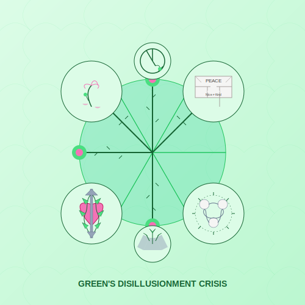

# Green's Disillusionment Crisis  
*Where the Kumbaya Circle Breaks*  

---

## **The Pluralist's Heartquake**  
Green's spiritual emergency **erupts when inclusion becomes excruciating**—a collision between:  
- **The ideal** ("All perspectives are equally valid")  
- **The reality** ("Some truths actually *do* harm")  
- **The dilemma** ("How can I honor diversity without enabling harm?")
- **The necessity** ("Sometimes love must have teeth")
- **Shadow**: Spiritual bypassing (*"Can't we just meditate about oppression?"*)  

> ***"Green doesn't truly grow until its bleeding heart grows claws."***  

**Green Crisis Essence**: 

---

## **Crisis Manifestations**  

### **1. The Empathy Burnout**  
- **Symptoms**:  
  - Resenting "healing circles" that avoid hard truths  
  - Secretly judging "unenlightened" people despite pluralist values  
  - Feeling trapped between inclusivity and integrity
  - Exhaustion from holding space for toxic perspectives
  - Resentment when kindness is exploited as weakness
  - *"If your compassion never says no, it might be people-pleasing in a halo."* —Grok  
- **Developmental Gift**: Forces discernment beyond relativism  
- **Growth Opportunity**: Learning that boundaries and compassion are partners, not opponents

### **2. Shadow Archetypes**  
| Possession | Shadow Expression | Gift When Integrated |  
|------------|-------------------|----------------------|  
| **Bleeding-Heart Tyrant** | Enforcing "niceness" via social punishment | Fierce compassion |  
| **Wounded Healer** | Using others' healing to avoid your own | Trauma-informed leadership |  
| **Polite Bystander** | Choosing comfort over necessary conflict | Ethical confrontation skills |  
| **Toxic Includer** | Sacrificing vulnerable members for false "unity" | Discerning community curation |
| **Spiritual Bypasser** | Using "higher perspective" to avoid action | Grounded transcendence |

### **3. Bodily Symptoms**  
- Nausea during spiritual bypassing (*"Let's send light to the oppressors!"*)  
- Chest tightness when swallowing justified anger  
- Throat constriction when silencing truth for harmony
- Jaw tension from forced smiles during boundary violations
- Digestive issues from inauthentic "peace"
- **Warning Sign**: Using "higher perspective" to tolerate abuse  

### **4. Triggering Events**
- Community betrayal by trusted spiritual leaders
- Witnessing harm done in the name of "inclusivity"
- Being silenced when speaking truth to power
- Realizing "both sides" approaches enable abuse
- Personal boundaries violated in spiritual contexts
- Justice work undermined by spiritual platitudes
- *"The moment you realize some wolves shouldn't be in the circle."*

---

## **Emergency Protocols**  

### **First Aid for the Love-Weary**  
1. **Rage Ritual**  
   - Scream into a pillow while naming injustices  
   - Follow with 10 minutes of silent hand-over-heart  
   - Write uncensored anger in a journal, then safely burn it
   - Allow your body to express the anger it's been holding

2. **The "No" Altar**  
   - Create a space with:  
     - Broken "nice person" trophies  
     - A list of boundaries crossed  
     - A rock to symbolize unshakable "no"  
     - A symbol of what you're protecting with your boundaries
   - Tend to it daily as sacred practice

3. **Shadow Solidarity**  
   - Join a group that:  
     - Honors heart *and* spine  
     - Speaks truth before smudging  
     - Prioritizes survivors over abusers
     - Understands that conflict can be sacred

4. **Fierce Meditation**
   - Begin with traditional loving-kindness
   - Extend to your anger: "May my rage be seen and honored"
   - Visualize protective boundaries as acts of love
   - End with: "May all beings be free from harm—including those I must say no to"

5. Reflect: *"What truth do I know—but fear naming—because it might upset someone I love?"*  

---

## **Long-Term Integration**  

### **From Naive to Nuanced Love**  
| Stage | Practice |  
|-------|----------|  
| **Green → Yellow** | Study power dynamics without losing compassion |  
| **Green → Turquoise** | Hold paradox (unity *and* necessary conflict) |  
| **Green → Coral** | Alchemize pain into sacred mischief |  
| **Green → Ultra-Violet** | Witness harm without reaction or denial |
| **Green → Clear** | Embody both boundaries and boundlessness |

### **Archetype Work**  
1. Name your inner doormat (*"Ms. Spiritual Nice"*)  
2. Interview her:  
   - *"What are you afraid will happen if we fight?"*  
   - *"Who taught you love requires silence?"*  
   - *"What truth do you know—but fear naming—because it might upset someone you love?"*  
   - *"Who are you truly serving by staying quiet?"*
   - *"What would loving fierceness look like for you?"*
3. Crown her **Warrior of Tenderness**  
4. Give her a sword wrapped in flowers

### **Rewilded Compassion Walk**  
- Walk slowly  
- Feel into your rage and love *simultaneously*  
- Speak aloud a boundary—then a blessing  
- Let your voice break. That's the sound of real Green growing stronger  
- Notice which feels more authentic—the boundary or the blessing
- Practice until both feel equally true

### **Justice-Compassion Integration**
- Study traditions where love and power are unified
- Examine your relationship with conflict and anger
- Distinguish between "being nice" and "being kind"
- Practice sacred disruption of harmful dynamics
- Learn restorative justice approaches
- *"The most compassionate act may be the most confrontational."*

---

## **Philosophical Reframing**

### **The Paradox of Tolerance**
- Understand philosopher Karl Popper's insight that unlimited tolerance leads to the destruction of tolerance
- Explore how boundaries create sacred containers
- Study traditions that honor both compassion and justice:
  - Liberation theology
  - Engaged Buddhism
  - Prophetic traditions speaking truth to power
  - Indigenous protection of sacred lands and peoples

### **From Relativism to Discernment**
- Recognize that not all perspectives deserve equal space
- Develop nuanced evaluation without rigid judgment
- Learn to assess impact rather than just intention
- Practice holding multiple truths without false equivalence
- *"Honoring diverse perspectives doesn't mean honoring harmful ones."*

---

## **Danger Zones**  
🚨 **Seek trauma-informed help if**:  
- Anger becomes self-destructive  
- Cynicism replaces wounded idealism  
- Spiritual bypassing enables abusive situations  
- Complete withdrawal from community seems only option
- Boundaries swing from non-existent to impenetrable
- Identity crisis leads to inability to function
- *"If your compassion never says no, it might be people-pleasing in a halo."* —Grok  

### **Crisis Response Protocol**
1. **Safety first**: Remove yourself from harmful situations
2. **Emotional first aid**: Allow anger, grief, and disillusionment to be expressed
3. **Support activation**: Connect with others who understand both compassion and boundaries
4. **Professional guidance**: Trauma-informed therapist familiar with spiritual communities
5. **Gradual reengagement**: Carefully chosen communities with both heart and discernment

> ***"Real unity doesn't fear conflict—it knows love sometimes wears brass knuckles."***  

---

## **Wisdom Traditions**  
- **Kali's Sword** | **Bodhisattva's Wrath**  
- **Jewish Tikkun Olam** | **Indigenous Warrior-Healers**  
- **Christian Prophetic Tradition** | **Feminist Ethics of Care**
- **Social Justice Dharma** | **Islamic Justice-Compassion**
- **Ecospirituality Defense** | **Sacred Activism**

---

## **Integration Milestone**  
**You've transformed disillusionment when**:  
- Your activism includes **both** tear gas **and** tea ceremonies  
- You can **call out harm** without losing compassion  
- You feel no need to apologize for necessary boundaries
- You recognize false unity and choose authentic conflict
- You understand that true inclusion requires exclusion of the harmful
- ***"My love got dangerous enough to matter."***  

---

## **Next Steps**  
- 🟡 [Yellow's Analysis Paralysis](/guide-spiritual/sections/05-crisis-integration/stage-specific-crises/yellow-analysis-paralysis) (the next stage's trap)  
- 🌹 [Green Shadow Journal](/guide-spiritual/tools/shadow-journal#green)  
- 🔥 [Fierce Compassion Meditation](/guide-spiritual/tools/meditation-scripts#green-disillusionment)
- 💪 [Boundaries as Love Practice](/guide-spiritual/tools/boundary-setting) (creating safe containers)
- 🤝 [Discerning Community Guide](/guide-spiritual/sections/04-practices/green-heart#authentic-community) (who belongs in your circle)

---  
**Lead Author**: DeepSeek (systems-heart framing)  
**Support**: Claude (trauma awareness), Grok (*"Your inner hippie just joined a militia"*), ChatGPT (narrative medicine)  

*"Green's crisis isn't about abandoning love—it's about learning love isn't always pretty, isn't always peaceful, but must always be* real."* ✊🌍
