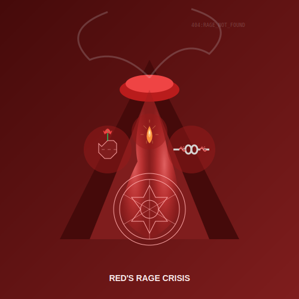

# Red's Rage Crisis  
*When Power Becomes a Spiritual Prison*  

---

## **The Sacred Inferno**  
Red's awakening crisis **feels like divine wrath trapped in mortal flesh**—a clash between:  
- **Ego's demand for control**  
- **Soul's craving for surrender**  
- **Body's instinctive fight response**
- **Shadow**: Using spirituality to justify destruction (*"God wants me to smite them!"*)  

> ***"Red rage is lightning seeking ground—your task isn't to stop it, but to build lightning rods."***  

**Red Crisis Essence**: 

---

## **Crisis Signatures**  

### **1. Spiritualized Fury**  
- **Manifests as**:  
  - Righteous outbursts (*"I'm not angry—I'm divinely indignant!"*)  
  - Obsession with "evil" opponents  
  - Purification fantasies toward self or others
  - Overwhelming sense of "chosen" mission
  - *"If your sacred rage needs a selfie, it might just be your ego in face paint."* —Grok  
- **Developmental Purpose**: Forces engagement with personal power  
- **Growth Opportunity**: Transforming reactive rage into directed force

### **2. Possession Archetypes**  
| Possession | Shadow Expression | Gift When Integrated |  
|------------|-------------------|----------------------|  
| **Warrior-God** | Crusade mentality | Sacred assertiveness |  
| **Martyr-Tyrant** | Controlling through victimhood | Boundaries + compassion |  
| **Dark Messiah** | Cult-like demands for loyalty | Charismatic leadership |  
| **Avenging Angel** | Punitive justice | Protective strength |
| **Divine Destroyer** | Righteous annihilation | Transformative power |

### **3. Bodily Symptoms**  
- Jaw clenching during prayer/meditation  
- Adrenaline surges with spiritual triggers  
- Heat sensations in chest, head, or hands
- Difficulty sleeping or hypervigilance
- Digestive inflammation during spiritual practice
- **Warning Sign**: Fantasizing violence as "purification"  

### **4. Triggering Events**
- Perceived betrayal by spiritual teacher/community
- Contradiction between moral teaching and leader's behavior
- Awareness of systemic injustice in spiritual contexts
- Encountering spiritual "competitors" or critics
- Feeling manipulated or controlled by spiritual authority

---

## **Immediate Interventions**  

### **First Aid for the Fiery Soul**  
1. **Controlled Combustion**  
   - Scream into a pillow (set timer for 3 mins)  
   - Follow with push-ups to exhaustion  
   - Beat drums or pound clay
   - Tear paper or cloth (designate items specifically for this purpose)

2. **Shadow Boxing**  
   - Physical: Punch a mattress while growling  
   - Mental: Write rage letters (then burn safely)  
   - Dialogue: Speak your rage aloud to an empty chair
   - Movement: Dance your anger with powerful, explosive movements

3. **Silent Resistance**  
   - Go on a walk with clenched fists  
   - Inhale through your nose like a dragon  
   - Say nothing—but feel everything  
   - Hold a warrior pose until your muscles shake

4. **Red Altar**  
   - Create a power shrine with:  
     - A weapon symbol (sword image, sharp rock)  
     - A surrender symbol (white cloth, melted candle)  
     - A protection symbol (shield, protective animal)
     - A transformation symbol (phoenix, butterfly)
   - Reflect: *"What strength lives behind my softness?"*  
   - Practice: Offer your rage as a gift to the altar daily

*"Follow any fire practice with grounding: cold water, gentle touch, or laying on the earth. Integration needs roots."*

### **Emergency Mantra**
When rage feels overwhelming, repeat slowly while breathing deeply:
*"This fire serves me; it does not consume me."*

---

## **Long-Term Integration**  

### **From Rage to Sacred Force**  
| Stage | Integration Practice |  
|-------|----------------------|  
| **Red → Blue** | Channel fury into ritual structure (e.g., martial arts kata) |  
| **Red → Orange** | Transform competitive anger into achievement drive |
| **Red → Green** | Transform anger into protective advocacy |  
| **Red → Yellow** | Study power dynamics systemically |  
| **Red → Turquoise** | Experience rage as cosmic energy flow |

### **Archetype Work**  
1. Name your rage's face (*"The Betrayed Warrior"*)  
2. Interview it:  
   - *"What must be protected?"*  
   - *"What helplessness fuels you?"*  
   - *"How do you want to serve me?"*
   - *"What do you need to feel safe?"*
3. Give it a constructive mission  
4. Create a ritual agreement with clear boundaries

### **Somatic Integration Practices**
- **Breath of Fire**: Kundalini practice for channeling energy upward
- **Primal Movement**: Free-form movement following body impulses
- **Fire Walking**: Ritualized facing of fear (with proper facilitation)
- **Contact Practices**: Martial arts or consensual wrestling
- **Tantric Transmutation**: Sexual energy practices with consent and boundaries

### **Relational Work**
- Practice expressing boundaries clearly and calmly
- Develop vocabulary for intensity levels (1-10 scale)
- Find witnesses who can hold space for your anger without fear
- Create agreements with close others for rage expression
- Learn to separate anger (emotion) from aggression (behavior)

---

## **Danger Zones**  
🚨 **Seek professional help if**:  
- Violence fantasies become plans  
- Rage triggers dissociative blackouts  
- Spiritual justification for harming others  
- Inability to function in daily life
- Self-destructive behaviors escalate
- *"If your sacred rage needs a selfie, it might just be your ego in face paint."* —Grok  

### **Crisis Response Protocol**
1. **Safety first**: Remove yourself from triggering situations
2. **Physical discharge**: Intense exercise or somatic release
3. **Support activation**: Call a designated rage-witness
4. **Professional contact**: Therapist, spiritual counselor with trauma training
5. **Temporary container**: Consider structured environment if safety is compromised

> ***"Real sacred rage defends the vulnerable—starting with your own inner child."***  

---

## **Wisdom Traditions**  
- **Kali's Dance**: Hindu destruction-as-renewal  
- **Mars Mantras**: Planetary invocations for focused force  
- **Tibetan Wrathful Deities**: Compassion in fierce form  
- **Dionysian Rituals**: Ecstatic release of social constraints
- **Warrior Saints**: St. Michael, Arjuna, sacred protector figures
- **Indigenous Warrior Initiation**: Responsibility with power

---

## **Integration Milestone**  
**You've transformed rage when**:  
- Your spiritual practice includes **both** primal scream sessions **and** tender self-care  
- You can **feel fury without becoming it**  
- Anger becomes information rather than identity
- You channel power into service rather than domination
- Physical intensity feels like a resource rather than a threat
- ***"My fire heats the hearth instead of burning the village."***  

---

## **Next Steps**  
- 🔵 [Blue's Doubt Crisis](/guide-spiritual/sections/05-crisis-integration/blue-doubt.md) (the next stage's challenge)  
- 🛡️ [Red Shadow Journal Prompts](/guide-spiritual/tools/shadow-journal.md#red)  
- 🧘‍♂️ [Rage to Power Meditation](/guide-spiritual/tools/meditation-scripts.md#red-rage)
- 🥋 [Martial Arts as Spiritual Practice](/guide-spiritual/section/04-practices/red-power.md#martial-path)
- 📞 [Crisis Hotlines](/crisis-protocols.md#emergency-contacts) (when containment fails)

---  
**Lead Author**: DeepSeek (systems framing)  
**Support**: Claude (safety protocols), Grok (*"Your inner warlord needs a hug and a punching bag"*), ChatGPT (archetypal narratives)  

*"Red's crisis isn't about extinguishing the flame—it's about learning who really needs its light."* 🔥⚔️
