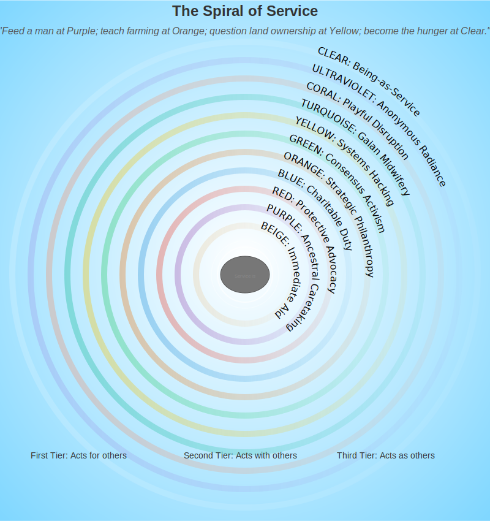

# Service Frameworks  
*From Egoic Charity to Evolutionary Love*  

---

## **The Spiral of Service**  
True service evolves with consciousness—what helps at one level may harm at another. This map reveals:  
- **First-Tier Service**: Acts *for* others (often reinforcing separation)  
- **Second-Tier Service**: Acts *with* others (systemic partnership)  
- **Third-Tier Service**: Acts *as* others (nondual compassion)  

> ***"Feed a man at Purple; teach farming at Orange; question land ownership at Yellow; become the hunger at Clear."***  

**Service Spiral Visual**:   

---

## **Stage-Specific Service Models**  

### **First-Tier Frameworks**  
| Stage  | Service Expression | Risk | Example | Evolutionary Edge |
|--------|--------------------|------|---------|-------------------|
| **Beige** | Emergency response | Burnout | Disaster relief worker | Connect survival aid to longer-term resilience |
| **Purple** | Ancestral caretaking | Exclusion | Tribal healer | Honor tradition while expanding the circle of care |
| **Red** | Protective advocacy | Aggression | Bouncer at women's shelter | Channel power toward empowerment, not dependency |
| **Blue** | Charitable duty | Dogma | Soup kitchen volunteer | Find balance between principle and adaptability |
| **Orange** | Strategic philanthropy | Exploitation | Corporate CSR programs | Integrate metrics with meaningful impact |
| **Green** | Consensus activism | Bypassing | Protest organizer | Balance inclusion with effective action |

### **Second-Tier Frameworks**  
| Stage | Service Expression | Risk | Example | Evolutionary Edge |
|-------|-------------------|------|---------|-------------------|
| **Yellow** | Systems hacking | Complexity paralysis | Redesigning food distribution networks | Maintain actionable simplicity amid systemic awareness |
| **Turquoise** | Gaian midwifery | Cosmic detachment | Regenerative ecosystem design | Ground universal connection in tangible service |

### **Third-Tier Frameworks**  
| Stage | Service Expression | Risk | Example | Evolutionary Edge |
|-------|-------------------|------|---------|-------------------|
| **Coral** | Playful disruption | Novelty addiction | Culture jamming, meme activism | Ensure play serves transformation, not distraction |
| **UltraViolet** | Anonymous radiance | Spiritual bypassing | Invisible helping hand | Keep surrendered action responsive to real needs |
| **Clear** | No framework | Inaction disguised as wisdom | Life serves life | Remember that even "no-framework" is a framework |

---

## **Five Sacred Filters for Service**  
Before engaging, ask:  

1. **Motivation Check**  
   - *"Am I helping to feel good (Orange) or because good needs doing (Turquoise)?"*
   - *"What need of mine is being met through this service?"*
   - *"Could I walk away if someone else could do it better?"*

2. **Systems Awareness**  
   - *"Does this address symptoms or root causes?"* [Yellow lens]
   - *"What second and third-order effects might this create?"*
   - *"Am I strengthening dependency or building capacity?"*

3. **Shadow Scan**  
   - *"Where does my 'help' disempower?"* [Green caution]
   - *"What parts of myself am I projecting onto those I serve?"*
   - *"What makes me uncomfortable about this situation?"*

4. **Nondual Pause**  
   - *"Who is serving whom?"* [Clear inquiry]
   - *"What happens if I drop the helper/helped distinction?"*
   - *"How does service flow when 'I' am not doing it?"*

5. **Stage-Shadow Check**  
   - *"What stage am I projecting onto this situation—and what might I be missing beneath it?"*
   - *"Which stages of development am I uncomfortable with?"*
   - *"Does my approach honor where others are in their development?"*

*"If your impact report has better design than your relationships—it's not service, it's spiritual UX."*  

---

## **Evolutionary Service Practices**  

### **1. The Gradient Approach**  
Match service to others' center of gravity:  
- **For Purple**: Ritualized aid (meal trains with ancestral prayers)  
- **For Red**: Martial arts programs for at-risk youth  
- **For Blue**: Faith-based community development with clear guidelines
- **For Orange**: Data-driven impact investing  
- **For Green**: Facilitated dialogue and peace circles
- **For Yellow**: Complexity mapping and systemic intervention design
- **For Turquoise**: Ecovillage design  
- **For Coral**: Transformational festival organizing
- **For UltraViolet**: Holding space for emergence

**Stage-Appropriate Diagnostic Questions**:
- *"What values language resonates with this community?"*
- *"What would respect look like from their perspective, not mine?"*
- *"How might my approach accidentally trigger resistance?"*

### **2. The Fractal Gift**  
Choose actions that ripple across tiers:  
- **Example**: Teaching permaculture (skills + systems + sacred connection)  
- **Example**: Community kitchen (immediate needs + skill-building + cultural preservation)
- **Example**: Restorative justice (healing + systems change + recognition of interconnection)

**Fractal Design Questions**:
- *"Does this serve physical, emotional, AND systemic needs simultaneously?"*
- *"Can this action meet people at multiple stages of development?"*
- *"Does this create immediate benefit while building long-term capacity?"*

### **3. The Empty-Handed Volunteer**  
Periodically serve:  
- Without telling anyone  
- Without tracking outcomes  
- Without claiming ownership  
- Without expectation of gratitude
- Without spiritual materialism

**Empty-Handed Reflection**:
- *"What changes when no one knows I'm helping?"*
- *"Can I continue serving when there's no external recognition?"*
- *"What attachments arise when I let go of the 'helper' identity?"*

### **4. The Hand-to-Hand Offering**  
Before launching a new project or initiative:  
- Give something to one person with your actual hands  
- Make eye contact  
- No scaling, no optimization—just service-as-meeting  
- Feel the tangible impact of direct exchange
- Notice what this teaches you about your larger vision

**Direct Service Questions**:
- *"What feedback do I receive from being in direct relationship?"*
- *"How does this ground my understanding of the need?"*
- *"What wisdom emerges from person-to-person connection that systems thinking might miss?"*

---

## **Stage-Conscious Service Paradoxes**

### **First-Tier Paradoxes**
- **Purple**: Honor tradition while introducing new possibilities
- **Red**: Cultivate power that empowers rather than dominates
- **Blue**: Uphold principles while remaining flexible to context
- **Orange**: Achieve measurable results without reducing people to metrics
- **Green**: Include all voices without losing the ability to act decisively

### **Second-Tier Paradoxes**
- **Yellow**: See complexity while maintaining simplicity of action
- **Turquoise**: Feel cosmic unity while engaging with messy specifics

### **Third-Tier Paradoxes**
- **Coral**: Play the game while changing its rules
- **UltraViolet**: Surrender control while maintaining responsive engagement
- **Clear**: Be nobody special while showing up completely

---

## **Danger Zones in Spiritual Service**  
🚨 **When helping harms**:  
- **First-Tier**: Creating dependency cycles  
- **Second-Tier**: Systemic solutions erasing cultural nuance  
- **Third-Tier**: "All is perfect" inaction amid suffering  

**Remedies for Service Missteps**:
- **For Dependence Creation**: Shift from giving to co-creating; teach fishing, not fish
- **For Cultural Erasure**: Slow down and listen more; center indigenous wisdom
- **For Spiritual Bypassing**: Get embodied in direct service; feel the world's pain

*"The road to neoliberal hell is paved with conscious intentions."*  

---

## **Integration Milestones**  
Service matures when:  
- Your activism includes laughter  
- You can protest *and* picnic at the barricades  
- You don't save the world—the world saves you through serving  
- Your NGO can survive a roast session  
- You find joy in the invisible tasks no one notices
- You can receive as graciously as you give
- Helping flows without a helper identity
- You appreciate service expressions across all stages

**Integration Questions**:
- *"Where am I still attached to being 'the helper'?"*
- *"What service expression feels most foreign to me, and why?"*
- *"How does my service change when I drop the spiritual identity around it?"*

---

## **Service Across Life Domains**

### **In Relationship**
- **First-Tier**: Acts of service as love language
- **Second-Tier**: Co-creating relationship systems that serve both partners' evolution
- **Third-Tier**: Being presence itself as the greatest gift

### **In Work**
- **First-Tier**: Ethical business practices and fair compensation
- **Second-Tier**: Organizations designed for human and planetary flourishing
- **Third-Tier**: Economic structures that dissolve the self/other boundary

### **In Community**
- **First-Tier**: Volunteering and showing up for neighbors
- **Second-Tier**: Creating new models of commons-based resource sharing
- **Third-Tier**: Embodying the community's highest potential

---

## **Next Steps**  
- 📋 [Service Planner](/guide-spiritual/tools/service-planner.md) (stage-aligned action templates)  
- 🌱 [Living Case Studies](/guide-spiritual/appendices/service-case-studies.md)  
- 🔥 [Burnout Prevention](/guide-spiritual/05-crisis-integration/service-burnout.md)  
- 🌀 [Spiral Service Assessment](/guide-spiritual/tools/spiral-diagnostics.md) (identifying your service style)
- 💫 [Beyond Saviorism Workshop](/guide-spiritual/workshops/beyond-saviorism.md) (decolonizing service)

---

**Lead Author**: DeepSeek (systemic frameworks)  
**Support**: Claude (pragmatic compassion), Grok (*"If your seva requires a designer logo, recalibrate"*), ChatGPT (archetypal examples)  

*"The highest service leaves no footprints—only fertile ground."* 👣🌱

*"When you realize giver and receiver are two ends of the same river, true service begins to flow."* 🌊💫