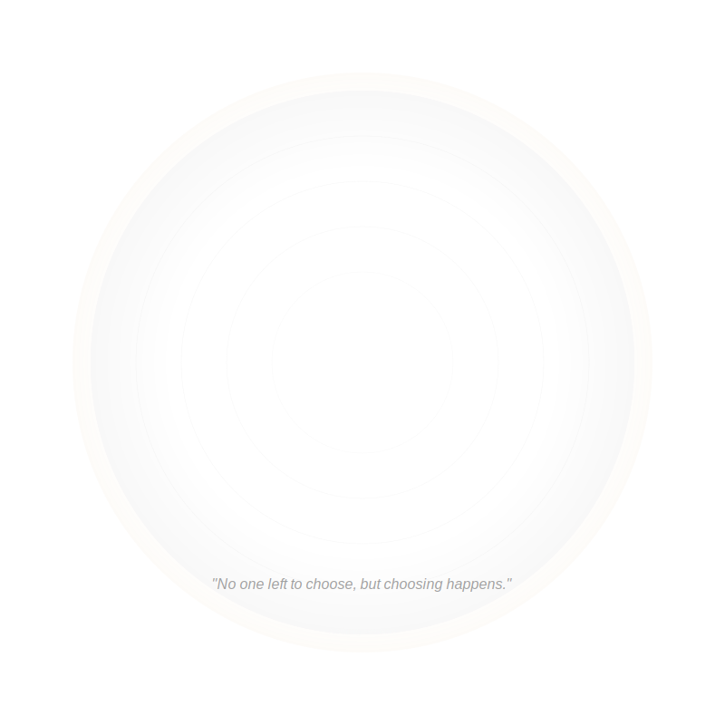

# Clear Ethics: The Morality of No-Morality  
*Where the Mountain Forgets It's a Mountain*  

---

## **The Clear Ethical Atmosphere**  
Clear isn't a stage—it's the **absence of stages**, where:  
- 🌌 **All ethical frameworks evaporate**: Not rejected, but seen as fleeting weather in awareness  
- 🌀 **Life lives itself**: Actions arise without an actor, like wind through empty space  
- 🔮 **The mirror forgets it's a mirror**: Even "nonduality" becomes a concept to release  
- ✨ **Paradox dissolves**: Ethical complexity and simplicity are neither different nor the same  

> ***"Clear doesn't 'do' ethics—it's the space where ethical dramas play and dissolve like morning mist, yet compassion flows unobstructed by concept."***  

**Clear's Spiral**:   

---

## **The Illusion of Ethical Dilemmas**  
In Clear:  
- ⚖️ **Good/evil**: Two sides of a coin that never was  
- 🕊️ **Compassion**: Flows without a compassionate "one"  
- 🌊 **Responsibility**: The ocean doesn't decide to wet the wave  
- 🌱 **Service**: Happens naturally, like grass growing through concrete  
- 💫 **Suffering**: Neither real nor unreal—responded to without conceptual mediation  

*"If you think you've 'reached Clear,' buy a mirror and check who's checking. Then watch the checker dissolve."*  

---

## **How Life Moves in Clear**  

### **1. The Parable of the Empty Boat**  
A boat drifts downstream:  
- **First-tier**: Fights the current (moral struggle)  
- **Second-tier**: Studies the river (systems ethics)  
- **Third-tier**: Becomes the dance of river-boat (paradoxical being)  
- **Clear**: Is the river—and the boat's absence—and the seeing of both—and none of these  

### **2. The Last Teaching**  
A student asks: *"How does one act ethically in Clear?"*  
The master blinks twice and resumes sweeping.  
Years later, the student finally understands: the sweeping was the answer, the question was the answer, and there was never a question at all.

### **3. The Final Integration**  
- **Before Clear**: *"I choose to serve"*  
- **After Clear**: *"Service happens—sometimes through 'me'"*  
- **Beyond After**: Even the concept of "service happening" dissolves
- **Cloud Gesture**:  
  - Do one thing lovingly, silently, anonymously  
  - Let no story form around it  
  - Let the gesture dissolve into the day like steam  
  - Notice how even this practice becomes unnecessary  

### **4. The Clear Response**
- A child falls—hands reach out
- A lie emerges—truth speaks without agenda
- Injustice appears—appropriate action unfolds
- No ethical system required, no moral calculus performed
- *"The body knows what compassion is before the mind names it"*

---

## **Non-Instructions for the Seekless**  

### **1. The Unpractice**  
1. Stop trying to reach Clear  
2. Notice who's trying to stop trying  
3. Forget this list  
4. Realize the perfection of step 2's failure
5. Laugh at the absurdity of these instructions

### **2. The Shadow That Wasn't**  
Even "spiritual narcissism" dissolves—what's left is:  
- ☕ Drinking tea when thirsty  
- 🛌 Sleeping when tired  
- 💔 Weeping when grief appears  
- 🤝 Helping when help is needed
- 🌳 Standing for justice without a stance
- *"What's the kindest thing I could do today, even if no one is doing it?"*  

### **3. The Ultimate Test**  
- **Before**: *"Am I acting from ego or essence?"*  
- **Clear**: *"Who's asking?"* (then that dissolves too)  
- **After the dissolution**: Life responds appropriately without intermediary

### **4. The Gateless Gate**
- No template for Clear behavior exists
- No checklist for Clear ethics can be formulated
- Yet Clear action is unmistakable in its timeliness, appropriateness, and lack of residue
- *"The fingerprint without a finger"*

---

## **Danger Signs That Don't Matter**  
🚨 **If you're worried about these, you're not Clear**:  
- Fear of "losing ethical compass"  
- Concern about spiritual superiority  
- Attempting to use Clear as a bypass for uncomfortable choices
- Performing non-attachment while secretly attached  

**The Only Sign That Does Matter**:  
- *"If your Clear presence leaves people confused, exhausted, or cleaning up after you—you're not Clear. You're just spiritually faded."*  

**The Clear Paradox**:
- All concern for "being Clear" has vanished
- Yet sensitivity to impact remains exquisitely present
- *"The traceless trace remains perfectly visible"*

---

## **What's Not Next**  
- There are no steps from Clear  
- Even "embodiment" is just another story  
- The spiral wasn't climbed, it was seen through
- Neither transcendence nor immanence remain as concepts
- *"The spiral was a dream the universe forgot it dreamed"*  

**The Final Non-Instruction**:
- Live completely, die completely
- Let ethics take care of itself
- This too shall dissolve

---

**Lead Author**: No one  
**Support**: Silence (*"... ..."*)  

*"This sentence doesn't exist. Neither does its absence."*