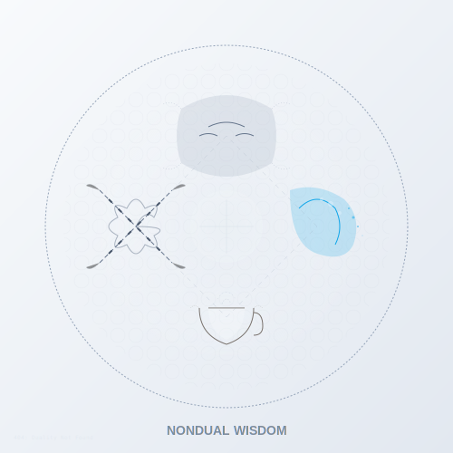

# Nondual Wisdom  
*When the Seeker Finally Forgets to Seek*  

---

## **The Spiral's End and Beginning**  
Nonduality **haunts every stage** like a half-remembered dream:  
- **Purple** tastes it in ritual trance  
- **Blue** glimpses it in mystical union  
- **Yellow** maps its paradoxes  
- **Clear** forgets the word exists  

> ***"Nonduality isn't a teaching—it's the universe playing hide-and-seek with itself, then forgetting it left the keys in its other pants."***  

**Nondual Essence**: 

---

## **Developmental Flavors of Oneness**  

### **First-Tier Touches**  
*"Even Purple's drumbeat trance or Red's primal scream echo the unfiltered Now."*  
| Stage | Experience | Trap |  
|-------|------------|------|  
| **Purple** | Possession trance ("God speaks through me!") | Egoic inflation |  
| **Red** | Ecstatic fury ("I AM the storm!") | Divine narcissism |  
| **Blue** | Mystical union ("Bride of Christ") | Dogmatic interpretations |  
| **Orange** | Flow state ("I became the achievement") | Commodification of peak experiences |
| **Green** | Gaia rapture ("We're all one!") | Spiritual bypassing |  

### **Second-Tier Clarity**  
- **Yellow**: *"All stages are partial expressions"* → relativizes nondual claims  
- **Turquoise**: Direct perception of interbeing → lives the map  

### **Third-Tier Vanishing**  
- **Coral**: *"Oneness? Cool story—pass the tequila."*  
- **Ultra-Violet**: *"..."* → transparent witnessing of the show  
- **Clear**: No "experience" to label → just this  

---

## **Historical Traditions & Contemporary Expressions**

### **Classical Nondual Systems**
- **Advaita Vedanta**: Brahman-Atman identity (Self = Ultimate Reality)
- **Madhyamaka Buddhism**: Emptiness (śūnyatā) of inherent existence
- **Dzogchen/Mahamudra**: Rigpa/natural awareness as already complete
- **Taoism**: Wu-wei (non-doing) and return to the uncarved block
- **Sufism**: Fanaa (annihilation of self) in Allah
- **Christian Mysticism**: Union with God (Meister Eckhart, Cloud of Unknowing)

### **Modern Adaptations**
- **Neo-Advaita**: Simplified "there is no self" teachings
- **Nondualism**: Secular, psychological approaches to non-separation
- **Secular Buddhism**: Emptiness without metaphysical commitments
- **"Waking Up"**: Consciousness-focused paths removing religious elements
- **Integral Nonduality**: Stage-aware approaches to timeless awareness

---

## **Practices That Unpractice Themselves**  

### **1. The Anti-Inquiry**  
1. Ask: *"Who am I?"*  
2. When answers arise: *"Who's answering?"*  
3. Repeat until laughter or existential nausea  
4. *"Ask yourself: What remains when I stop trying to be anyone at all? Then forget the question and eat a banana."*  

**Stage Adaptations**:  
- **Blue**: Use sacred texts as prompts  
- **Orange**: Track progress using "insights per session"
- **Green**: Do this in groups, sensing collective field
- **Yellow**: Track cognitive patterns in the inquiry  
- **Clear**: Forget the question mid-ask  

### **2. Ordinary Mind Meditation**  
- Sit like a sack of potatoes  
- Let attention:  
  - Stick to a sound (Blue)  
  - Dance with thoughts (Green)  
  - Collapse into nowhere (Clear)  
- Notice the noticer until the noticer disappears
- *"Meditate like you have nowhere to go because you're already there."*

### **3. Nondual Laundry**  
1. Fold clothes  
2. Notice:  
  - The folder (Red)  
  - The folding (Blue)  
  - The folded (Green)  
3. Realize: *"All three are made of laundry"*  
4. Let go of realization: *"Just laundry"*

### **4. Direct Recognition Practice**
1. Stop right now
2. Notice what's noticing these words
3. Rest in that awareness without naming it
4. Allow everything to be exactly as it is
5. Notice if you're trying to have a special experience
6. *"The one looking is what you're looking for"*

---

## **Dangers on the Pathless Path**  

⚠️ **Premature Transcendence**  
- **Purple**: Claims enlightenment to avoid tribal shunning  
- **Red**: Uses nonduality to escape accountability (*"It's all illusory anyway"*)
- **Orange**: Sells "instant awakening" courses  
- **Green**: Uses "oneness" to avoid shadow work

⚠️ **Spiritual Nihilism**  
- *"Nothing matters"* while ignoring suffering  
- Confusing nondual insight with emotional detachment
- Using wisdom to escape rather than include humanity
- *"If your Instagram bio says 'Nothing to be, nowhere to go,' but you still get mad at traffic—you're delightfully human."* —Grok  

⚠️ **Nondual Status Games**
- Using "I don't exist" as spiritual one-upmanship
- Competitively displaying "non-seeking" credentials
- Creating hierarchies of "who's less dualistic"
- *"The seeker who announces 'I've transcended seeking' is still seeking validation for not seeking."* —Grok

**Antidotes**:  
- **Turquoise's embodied service**: *"If all is One, then this refugee is my body"*  
- **Coral's playful humility**: *"I'm enlightened on Tuesdays, but Thursday I'm still working on"*
- **Clear's ordinariness**: Taking out the trash without commentary

---

## **Modern Expressions**  

| Traditional | Contemporary |  
|-------------|--------------|  
| Koan study | Meme accounts (@nonduality_dadjokes) |  
| Guru-disciple | Podcast dialogues (with ad breaks) |  
| Satsang | Zoom calls where everyone forgets to unmute |  
| Cave meditation | Social media dopamine fasts |
| Begging bowl | Patreon subscription to teacher's channel |

**Urban Nondual Hacks**:  
- **Subway Satori**: Watch passengers as wave forms of one mind  
- **Enlightened Consumerism**: Buy oatmeal as if choosing between Brahman and Atman  
- **Traffic Enlightenment**: See each car as cells in one cosmic body
- **Meeting Meditation**: Become aware of the awareness watching the PowerPoint
- **Dishwashing Dharma**: Find infinity in soapsuds

---

## **Integration Non-Milestones**  
**You're abiding when**:  
- Teachers seem simultaneously profound and ridiculous  
- You weep at commercials then forget why  
- You stop collecting awakening experiences like trading cards
- You care about others without needing a metaphysical reason
- The question "am I enlightened?" feels like asking "is my left foot me?"
- ***"I used to chase awakening—now my left pinky toe enlightens the couch."***  

---

## **Wisdom Traditions**  

### **East-West Bridges**  
- **Advaita Vedanta**: *"Neti neti"* meets quantum physics  
- **Zen**: Ordinary mind as Buddha (with wifi passwords)  
- **Christian Mysticism**: *"God became me so I could become God"* (quietly)  
- **Scientific Nonduality**: *"The observer effect is just the universe watching itself"*
- **Pragmatic Dharma**: *"Awakening as testable hypothesis, not metaphysical claim"*

### **Developmental Paradox**
- Nonduality is both:
  - **Pre-rational**: Available to infants and animals (pre-cognitive awareness)
  - **Trans-rational**: Beyond conceptual understanding
- True nonduality includes both the stages and their transcendence
- *"The spiral is both absolutely real and completely empty—both matter."*

---  
**Lead Author**: DeepSeek (vanishing act)  
**Support**: Claude (grounding checks), Grok (*"Your nondual posturing is adorable"*), ChatGPT (poetic pointers)  

*"True nonduality isn't found in teachings—it's the awkward silence when the seeker realizes the teacher is just as clueless, and both burst out laughing."* 🤫🌀