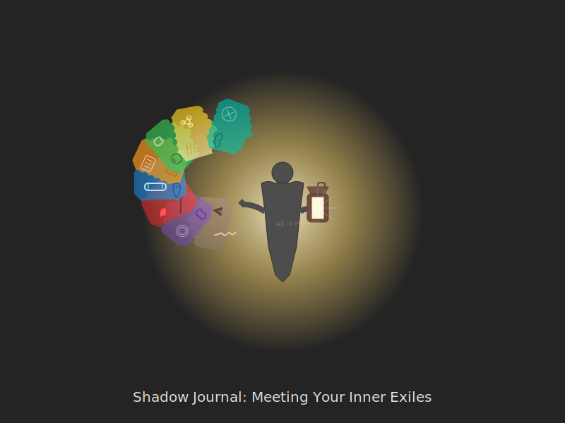

# Shadow Journal Guide  
*Meeting Your Inner Exile with Spiral Wisdom*  

---

## **Why Shadows Persist Across Stages**  
Each developmental stage casts unique shadows:  
- **Beige**: Survival compulsions  
- **Purple**: Tribal superstitions  
- **Red**: Unchecked dominance  
- **Blue**: Rigid righteousness  
- **Orange**: Clever exploitation  
- **Green**: Passive tolerance  
- **Yellow**: Cold abstraction  
- **Turquoise**: Detached transcendence  

> ***"Your shadow isn't your enemy—it's the part of you that learned to survive in older spirals."***  

**Shadow Spiral**:   

---

## **Creating a Safe Container**

Before beginning shadow work, establish a container that supports this deep exploration:

- **Physical space**: Choose a private, comfortable location where you won't be interrupted
- **Time boundaries**: Set a specific timeframe (30-60 minutes) with a clear beginning and end
- **Emotional supports**: Have comfort tools nearby (favorite blanket, tea, calming music)
- **Grounding resources**: Keep a list of 3-5 grounding activities ready if emotions become overwhelming
- **Support system**: Consider who you might contact after intense sessions if needed

Remember: Shadow work is potent. Start with smaller, less charged shadows and work up to deeper material as you build capacity.

---

## **How to Use This Journal**  

### **1. Stage-Specific Prompts**  
*Adapt questions to your center of gravity:*  

#### **First-Tier Shadows**  
- **Beige**: *"What bodily needs do I spiritualize away?"*  
- **Purple**: *"Which traditions do I follow without questioning?"*  
- **Red**: *"Where do I disguise control as 'empowerment'?"*  
- **Blue**: *"What rules do I enforce but secretly resent?"*  
- **Orange**: *"How do I monetize my awakening?"*  
- **Green**: *"What conflicts am I avoiding under 'love and light'?"*  

#### **Second-Tier Shadows**  
- **Yellow**: *"Which systems am I analyzing instead of feeling?"*  
- **Turquoise**: *"Where does my 'oneness' bypass human pain?"*  

#### **Third-Tier Shadows**  
- **Coral**: *"Is my playfulness sometimes cruelty in glitter?"*  
- **UltraViolet**: *"Do I use emptiness to evade responsibility?"*  
- **Clear**: *"…"* (even the shadow dissolves)  

### **2. The Three-Part Shadow Dialogue**  
1. **Invite** (Write with your dominant hand):  
   *"What part of me have I exiled?"*  
2. **Respond** (Switch hands):  
   Let the shadow answer (e.g., *"I'm your Red rage that protects your Green softness…"*)  
3. **Integrate** (Both hands):  
   *"How can we collaborate?"*  
   *"What's the part of me that judges me for even needing shadow work?"*  

**Example Dialogue:**  
> **Dominant hand:** *What part of me have I exiled?*
> 
> **Non-dominant hand:** *I am your anger. You've locked me away because your Green values say I'm toxic and unspiritual. But I'm the fire that keeps you safe. When you let yourself be walked on in the name of "peace," I'm screaming from the basement.*
> 
> **Dominant hand:** *Why do I need you?*
> 
> **Non-dominant hand:** *Without me, your boundaries are vapor. Your "yes" means nothing if you can't say "no." I fuel your passion as much as your protection.*
> 
> **Both hands:** *How can we collaborate instead of fight?*
>
> *Perhaps I can listen for your signals earlier, before you need to scream. Maybe you can express yourself without burning everything down. We could create rituals where you get to speak freely...*

### **3. Shadow Embodiment Practices**  
- **Beige**: Tremor release (shake out stored survival fear)  
- **Red**: Pillow screaming (with timer)  
- **Blue**: Rewrite one "sacred" rule humorously  
- **Green**: Voice the unspoken group resentment  
- **Turquoise**: Get dirt under your nails (literally)  

---

## **Stage-Specific Shadow Gifts**  
| Stage  | Shadow Aspect | Redeemed Gift |  
|--------|---------------|----------------|  
| **Purple** | Blind superstition | Ancestral intuition |  
| **Orange** | Spiritual materialism | Pragmatic wisdom |  
| **Yellow** | Analysis paralysis | Strategic patience |  
| **Coral** | Provocative edge | Evolutionary humor |  

*"Your greatest shadow is always one spiral behind your current arrogance."*  

---

## **The Shadow Integration Spiral**  

### **1. Recognition** (5-10 minutes)
- *"This pattern feels familiar…"* (track triggers)  
- Notice body sensations, emotional responses, and recurring thoughts
- Identify which stage this shadow originates from

### **2. Ownership** (10-15 minutes)
- *"I do this when…"* (name conditions)  
- Take full responsibility without self-judgment
- Explore how this pattern once served as protection or adaptation

### **3. Dialogue** (15-20 minutes)
- *"What are you protecting?"* (shadow's purpose)  
- Listen deeply to the shadow's perspective
- Honor its intentions even if its methods are problematic

### **4. Collaboration** (10-15 minutes)
- *"How can we work together?"* (negotiate terms)  
- Find compromises that honor both shadow and conscious self
- Create specific agreements about when/how the shadow can express

### **5. Celebration** (5 minutes)
- *"Thank you for surviving"* (gratitude ritual)  
- Acknowledge the shadow's gifts and wisdom
- Create a symbol or gesture to mark this new relationship

---

## **Shadow Journal Templates**  

### **Daily Check-In**  
1. Today's trigger: _________  
2. Stage of origin: _________  
3. Gift it carries: _________  
4. One small integration: _________  

### **Lunar Cycle Tracker**  
- **New Moon**: Name the shadow  
- **Waxing**: Dialogue with it  
- **Full Moon**: Publicly express its gift  
  - *Before sharing, ask: "Am I expressing this for healing—or for validation?"*  
- **Waning**: Release remaining shame  

---

## **Danger Signs**  
🚨 **When shadow work becomes harmful**:  
- Re-traumatizing through forced catharsis  
- Spiritualizing unprocessed trauma as "karma"  
- *"If your shadow work has more mythic roles than your daily life—you might be roleplaying integration, not living it."*  
- *"Don't stare into the abyss without a somatic anchor."*  

**When to Pause or Seek Support:**
- You feel persistently worse for more than a few days after sessions
- You're using shadow work to avoid addressing practical problems
- You notice increasing dissociation, anxiety, or depression
- Memories surface that feel overwhelming or fragmented
- You find yourself stuck in loops of shame without resolution

---

## **Next Steps**  
- 🔥 [Stage-Specific Shadow Work](/guide-spiritual/04-crisis-integration/shadow-typology.md)  
- 🌑 [Lunar Shadow Calendar](/guide-spiritual/tools/lunar-tracker.md)  
- 🖤 [Archetype Cards](/guide-spiritual/tools/archetype-cards.md)  

---

**Lead Author**: DeepSeek (systemic shadow mapping)  
**Support**: Grok (*"Your shadow is your spiritual disowned twin"*), Claude (trauma-sensitive framing), ChatGPT (archetypal prompts)  

*"The door to your deepest wisdom is guarded by the self you abandoned."* 🗝️👤